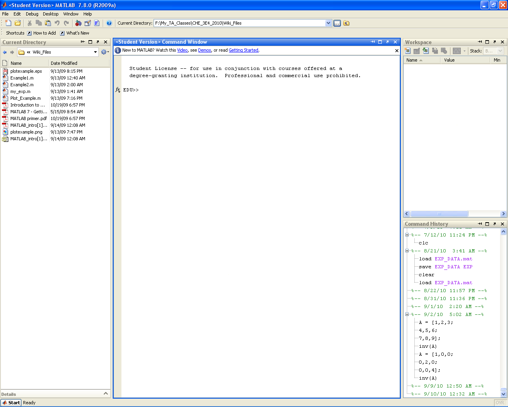
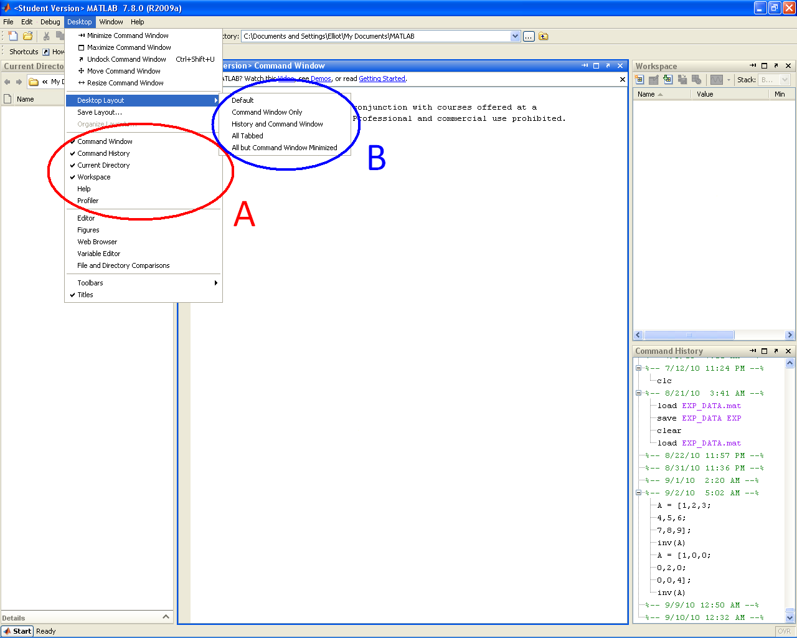
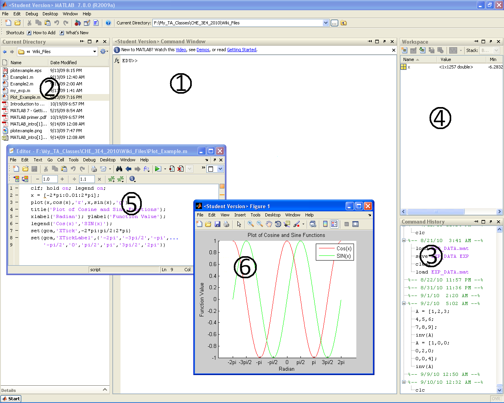
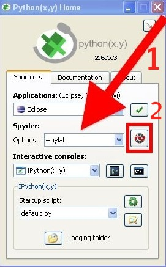

About MATLAB and Python
========================

MATLAB
-------

`From Wikipedia <http://en.wikipedia.org/wiki/MATLAB>`_:  MATLAB (MATrix LABoratory) is a high level computer language/interactive software package developed and distributed by MathWorks. MATLAB was first developed in the 1970s by Cleve Molar. Cleve was later joined by John N. Little and Steve Bangert and the three went on to found MathWorks. MATLAB excels at performing matrix operations and can handle large data sets (stored as matrices) very easily. MATLAB was originally designed as a user friendly interface for `LINPACK <http://en.wikipedia.org/wiki/LINPACK>`_ and `EISPACK <http://en.wikipedia.org/wiki/EISPACK>`_ and so was intended for linear algebra application. Since then MATLAB has greatly expanded it's core abilities to encompass a large array of graphic and numeric applications. These core abilities are expanded through the addition of specialized "tool boxes".

Python
-------

`From Wikipedia <http://en.wikipedia.org/wiki/Python_(programming_language)>`_: Python is a high-level programming language whose design philosophy emphasizes code readability. Python aims to combine "remarkable power with very clear syntax", and its standard library of built-in functions is large and comprehensive.  

We will use the `NumPy and SciPy <http://numpy.scipy.org/>`_ modules (the equivalent of a MATLAB toolbox), to provide scientific computing capabilities to Python.  These modules, like MATLAB, allow you to handle large data arrays with little effort.  

We will also use the `matplotlib <http://matplotlib.sourceforge.net/index.html>`_ module, which provides Python with plotting capabilities similar to MATLAB.

You might not be familiar with Python.  Here is a comparison with MATLAB:

* Many companies already use it as a standard package now.
* It can run on Windows, Linux and Mac computers
* Commercial software support is available from 3rd parties.
* The software can be installed on a local desktop, or in a networked environment and run remotely.
* It is free (both for academic and commercial use), so it can readily be deployed and used anywhere.
* Installation is straightforward.
* The license is not restrictive: you can legally modify and improve the software.
* There are excellent add-on libraries for almost anything you need.
* It promotes good practice of writing a code file, and then running it (like MATLAB and R).  The code documents what you have done, and you can always repeat your analysis on a new data set, or share the code with colleagues.  Other software packages tend to promote a more point-and-click approach, so you can't always retrace your steps.
* There are multicore and 64-bit versions of Python available to process large data sets, and do parallel data processing.

Installing MATLAB or Python
=============================

MATLAB
------

MATLAB may be purchased from `The Mathworks <http://mathworks.com>`_ either as the commercial version or student version.  You will also require the Statistics Toolbox for this tutorial.

Python
------

Python is freely available. The latest stable version that we recommend for this tutorial is version 2.6, because it is compatible with the external libraries that we will use.

Windows users
^^^^^^^^^^^^^^^

Python is an open source software. Because of this, various groups have "packaged" the official Python distribution to meet certain needs. For example:

* The official (reference) Python distribution: http://python.org
* Enthought Python distribution: http://www.enthought.com/epd 
* IronPython: http://ironpython.net/
* JPython: http://www.jython.org/

For this course we recommend you use the version distributed from http://www.pythonxy.com/, and called Python(X,Y).   If you are an experienced programmer, comfortable with the command prompt, then we actually recommend you use `Enthought's Python distribution <http://www.enthought.com/epd>`_: see the :ref:`Mac/Linux instructions <matpy-mac-linux-install>` below.

**Python(X,Y) installation**

* Official website: http://code.google.com/p/pythonxy/
* Latest version (January 2011): 2.6.5.6
* Official download page: http://code.google.com/p/pythonxy/wiki/Downloads

#.	Run the software installation after downloading the installation file from the above link, run the program.

#.	The default installation options are perfect for this tutorial.

#.	It can take quite a while to install.

#.	Continue with the :ref:`rest of this tutorial <matpy-getting-started>` to learn how to use Python.

.. _matpy-mac-linux-install:

Mac and Linux users
^^^^^^^^^^^^^^^^^^^^^^^^^^^^^^

Python is already installed on all Mac computers and most (all?) Linux computers. If you go to your command prompt (the program is called "Terminal" on Macs), you can type ``python`` and it will start a bare-bones Python session.

However, we highly recommend you use the Enthought Python distribution, which is better suited to our course. It contains all the tools that we require. Please follow these instructions to install it.

#.	Visit the academic download section of Enthought's website if you are a student, or download the 30-day trial, or purchase a regular license.

	.. figure:: images/enthought-download.png
		:scale: 100
		:align: center

#.	Download and install the software.
#.	It will take some time, because it installs Python and a large collection of libraries (modules).

.. _matpy-getting-started:

Getting started
==============================

MATLAB
-------

When you launch MATLAB the following window will open:

If MATLAB does not open exactly like this you can easily modify which regions are visible through the **Desktop** drop down menu. You can select the windows you want either by toggling them individually, Region A (red), or by selecting a template, Region B (blue). Selecting the *default* template should give you the window layout you saw above.

The core MATLAB setup has 6 main sections of interest that you will become very familiar with by the end of this course:

**1. Command Window**

	The command window (or "command line") provides your main means of interacting with the MATLAB software. The command line allows you to enter simple codes that are processed immediately. All program outputs also appear in the command window. While it is technically possible to write an entire program at the command line, this is not recommended. For true programs, scripts and functions will be used.

**2. Current Directory**	

	The "current directory" panel lists all of the files (MATLAB or other) that are located in the directory MATLAB is currently accessing. This directory may be changed via the drop down address bar at the top of the main program window. For a program to run properly, generally all code files required must be in the same directory (for example, if you write a main script file that calls a separate function file, both files must be in the same directory).

**3. Command History**

	The command history records all commands entered in the command window (for possible future reference).

**4. Workspace**

	The workspace lists all variables, matrices, and function handles currently being stored by MATLAB. The workspace also provides basic information on the values being stored, such as size, max, min, etc. Perhaps most useful is the ability to double click variables and matrices in the workspace to open up the **Variable Editor** window. The variable editor is essentially a spread sheet representation of your variables that allows for easy manipulation (especially useful for large matrices). 

**5. Editor Window**

	The editor window(s) does not immediately open when you launch MATLAB. The editor window is where you write scripts and function files that can be compiled and run in the command window (to be discussed in detail later). To open a new editor window you can either go to ``File -> New -> Blank M-File``, hit ``Ctrl+N``, type ``edit`` at the command line, or hit the *New M-File* icon at the top left of the main screen (it looks like the little piece of paper with the explosion in the top left corner). To open a pre-existing M-File you need to switch the current directory to the location of the file (as mentioned above) and simply double click on the M-File name in the "current directory" sidebar.

**6. Plot Window**

	When the MATLAB plot tools are used the resulting graphics are displayed in separate plot windows.

Python
-------

Windows users
^^^^^^^^^^^^^^^^^

When starting Python(x,y) you will be presented with the following window.

Spyder (Scientific PYthon Development EnviRonment) is the name of the development environment we will be using.

#.	Select the ``--pylab`` option
#.	Then launch the Spyder environment.

* Python(x,y) has a layout similar to that shown below 

	.. figure:: images/layout-pythonxy-low.jpg
		:scale: 100
		:width: 500
		:align: center
	
	
**1. Command Window**

	The command window is where you interact with Python. Commands entered here are processed immediately. While it is technically possible to write an entire program at the command line, this is not recommended. For true programs, you should write a script in region 5 of the software.

**Current Directory**

	The "current directory" panel lists all of the files that are located in the directory Python is currently accessing. This directory may be changed by navigating to a new directory and clicking on its name.

**3. Command History**
	
	The command history records all commands entered in the command window (for possible future reference).

**4. Workspace**

	The workspace lists all variables (e.g. vectors and matrices) currently available to you. The workspace also provides the size and "type" of variable.  You can double click on a variable and change its value: e.g. edit a specific entry in a vector, in a spreadsheet-like interface.

**5. Editor Window**
	
	The editor window is where you write scripts and function files.  After saving the file to disk, you can run it by pressing ``F9`` (or click on ``Source`` in the top menu and select ``Run in interactive console``)

	You can have one or multiple files open at any time.

**6. Plot Window**

	Python plots are opened in new separate windows, but can be "docked" (placed) anywhere inside the main Python(x,y) window.
	

Mac users
^^^^^^^^^^^

This tutorial step assumes that you have :ref:`already installed` Enthought's Python distribution.

#.	Start the **Terminal** program, which will bring up a command window.
 	
	.. figure:: images/Mac-starting-the-terminal.jpg
		:scale: 100
		:align: center

	
#.	Then type the following command to start::

		ipython --pylab

	and you should get something similar to this window
	
		.. figure:: images/Ipython-mac-screenshot.jpg	
			:scale: 100
			:width: 400px
			:align: center
			
Linux users
^^^^^^^^^^^^

This tutorial step assumes that you have :ref:`already installed` Enthought's Python distribution.

I expect you know how to start your shell, e.g. the ``bash`` shell.  Once you are in the shell, just type::

	ipython --pylab

and you should get something similar to this window (screen shot from Ubuntu Linux):

	.. figure:: images/Ipython-ubuntu-screenshot.jpg
		:scale: 100
		:width: 400px
		:align: center

where you can type in Python commands.

Read data into MATLAB or Python
=================================

Coming soon.

