.. Heading order

	======
	------
	~~~~~~

About R
========

R is a software package for statistical computing and graphics.  It has become a standard among statistical programming languages.

* Many companies already use it as a standard package now (as reported in `this New York Times article <http://www.ece.virginia.edu/~mv/edu/D2K/lectures/NYTimesR.pdf>`_, R is used by Google, Shell, Pfizer, Merck, Bank of America, and others).
* It can run on Windows, Linux and Mac computers.
* Commercial software support is available from 3rd parties.
* The software can be installed on a local desktop, or in a networked environment and run remotely.
* It is free (both for academic and commercial use), so it can be used in any academic or corporate environment.
* Installation is straightforward,
* The :index:`open-source` license is not restrictive: you can legally modify and improve the software.
* There are excellent add-on libraries for almost anything related to data analysis.
* It promotes good statistical practice of writing a code file, and then running it (like MATLAB). The code file documents what you have done, and you can always repeat your analysis on a new data set, or share the code with colleagues. Other software packages tend to promote a more point-and-click approach, so you can't always retrace your steps.
* There are multicore and 64-bit versions of R available to process large data sets, and do parallel data processing.

Alternatives
------------

.. note:: These alternatives are for students taking courses from ConnectMV.  Other alternatives may be more suited to your needs - please `contact us if in doubt <http://connectmv.com/contact-us>`_.

Other software alternatives you might consider are Minitab, MATLAB or Python.  Microsoft Excel is not recommended: it cannot perform some of the calculations and plots that you will require to properly analyze data, and its `statistical accuracy is very poor <http://dx.doi.org/10.1016/j.csda.2008.03.004>`_ (the article documents several Excel functions that produce incorrect results).

Installing R
=============

R is a standalone package.  However, to get the most benefit, you must install a good text editor that works with R also.  

If you are having trouble installing R, please `email us for assistance <mailto:kevin.dunn@connectmv.com>`_.

* **Official website**: http://www.r-project.org/
* **Latest version**: 2.12.1 as of 4 January 2011

Windows installation
---------------------

**Base R package**

* Visit the R-website: http://cran.r-project.org/bin/windows/base/
* Download and install the EXE file linked at the top of the page.

**R-compatible text editor**

.. ucomment:: MbQrKP: vy,

* Visit the `Tinn-R website <http://sourceforge.net/projects/tinn-r/>`_  to get the latest version; click on the "Download Now" button
* Save and install the EXE file 

..	
	Once installed, please start the R software package:

	* 	Go to the menu bar: click on ``Edit``
	* 	Select ``GUI preferences``
	*	In the first line, change to ``SDI``
	*	Click ``Save``
	* 	When asked for the directory, change to ``C:\Program Files\R\R-2.12.1\etc\`` and overwrite the existing ``Rconsole`` file
	* 	Click ``OK`` to exit the configuration editor
	* 	Quit the software package
	* 	When asked to ``Save workspace image``, choose ``No``
	
**Configuration**

After installing Tinn-R you need to configure Tinn-R to communicate with R:

*	*Vista and Windows 7 users*: right-click on the Tinn-R icon and choose ``Run as Administrator``.  For *Windows XP users*: just start Tinn-R by clicking on the icon.
*	Go to the menu at the top, click on ``R``
*	Then ``Configure``
*	Then ``Permanent``.  Answer ``OK`` when completed.

	.. ucomment:: xBkfjv: Mk, qt,
	
*	Next, you must start ``R`` from ``Tinn-R``:

	-	Click on ``Start/Close and connections``
	-	Select ``Rgui (start)``: this causes Tinn-R to start R.
	-	You will require internet access as it will continue to install several updates to allow Tinn-R and R to communicate.

Your windows will be arranged as shown here; you can see the internet updates taking place in the screenshot.

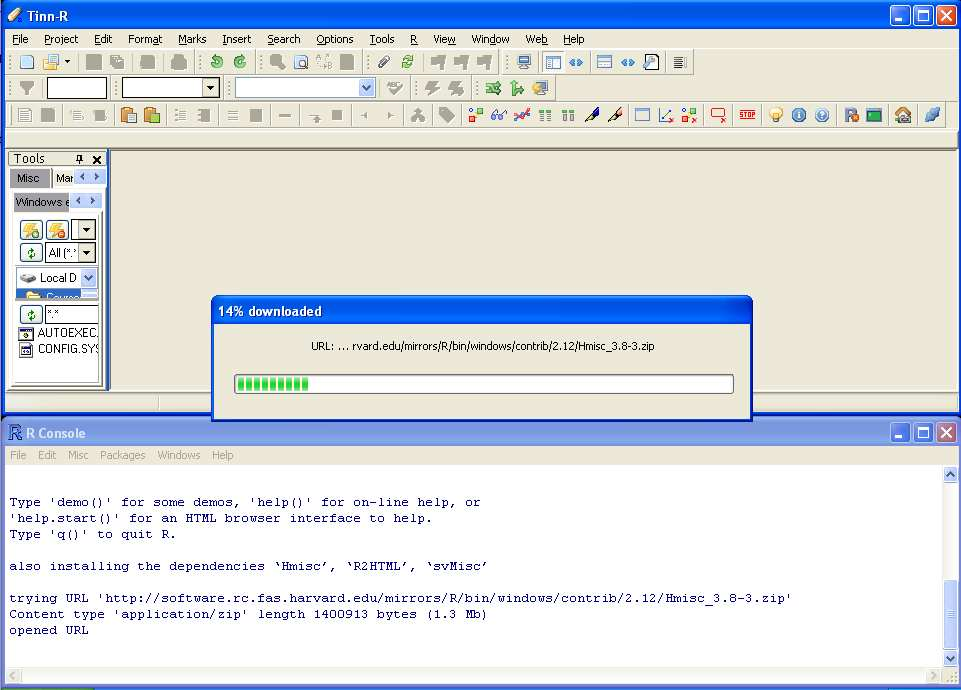

Mac installation
------------------------

* Download and install the latest R package file from http://cran.r-project.org/bin/macosx/
* A good text editor on a Mac's is the `TextMate editor <http://macromates.com/>`_.  This editor allows you to run your code directly from the editor, without having to start R.

  .. ucomment:: FXztKJ: Qh, 4z,

Linux installation
-------------------

* Visit the Linux site http://cran.r-project.org/bin/linux/
* Choose your Linux distribution: Debian, Redhat, Suse or Ubuntu
* Follow the installation instructions on the page
* Choose one of the many good Linux text editors: VI, Emacs. In particular, the Emacs editor can be `integrated with R using ESS <http://ess.r-project.org/>`_.

Getting started 
===============

.. note:: Any line beginning with the ``#`` character is a comment and is ignored by R.  I use these comments to show the expected output from R.

.. note:: Any line beginning with the ``>`` character indicates the R command prompt.  You can copy and paste from this tutorials, but don't paste in the ``>`` character.  Later on we will omit this character.

So start R and type the following:

..  code-block:: s

	# This is how to start the main help system in R
	> help.start()

The above line starts the web-browser on your computer and shows you the Help system for R. You can click on the links to get different levels of help.

Reading data into R
====================

The most interesting data to analyze is always your own.  How do we read your own data files into R?    We will look at when the data file is on your computer, or when the data is available somewhere on the internet.

.. note:: For now we only consider comma separated values (CSV) files.  R can read other files types, such as XML files, directly from databases, and other sources.  All the `details are here <http://cran.r-project.org/doc/manuals/R-data.html>`_.

Data on your hard drive
---------------------------

Go to the `datasets website <http://datasets.connectmv.com>`_ and download any data set, for example the **Website traffic** datasets.  Save the file, 
and remember the location.  For example:  ``C:/Courses/ConnectMV/data/website-traffic.csv``

.. note:: You must use the "``/``" character in R to separate directories (folders), not the "``\``" character, even in Windows.

We will use the ``read.csv`` command to read these comma-separated values (CSV) files. If you look inside the ``website-traffic.csv`` file you will how the data is stored: each column is separated by a comma, and each row is a new line.

..  code-block:: s
	
	> website <- read.csv('C:/Courses/ConnectMV/data/website-traffic.csv')
	
Linux and Mac users will have something like:

..  code-block:: s
	
	> website <- read.csv('/home/yourname/ConnectMV/data/website-traffic.csv')

You will get **NO** output to the screen if the data are successfully read in; you only will see something if an error occurred.

The ``<-`` operation means *assign the result of the expression on the right to the variable name on the left*. To see what the variable ``website`` looks like, just type ``website`` at the R command line:

..  code-block:: s

	> website

	#     DayOfWeek      MonthDay Year Visits
	# 1      Monday        June 1 2009     27
	# 2     Tuesday        June 2 2009     31
	# 3   Wednesday        June 3 2009     38
	# 4    Thursday        June 4 2009     38
	#  ...
	# 211    Monday   December 28 2009     24
	# 212   Tuesday   December 29 2009     18
	# 213 Wednesday   December 30 2009     10
	# 214  Thursday   December 31 2009      7

Reading data from the internet
------------------------------

You can read the data directly from the internet.  Go to the datasets website again and right-click on the CSV link for the data set you want to download.  Your web browser should have the right-click option :menuselection:`Copy Link Location`, or :menuselection:`Copy Shortcut` or something similar.

This will copy the address of the data set to your clipboard.  Then in R, you type:

..  code-block:: s
	
	website <- read.csv('http://datasets.connectmv.com/file/website-traffic.csv')

where the part between quotation marks is the web address you copied.  Use the paste function to avoid typing errors.

Getting help
-------------

Before continuing further, if you ever need help with an R command type ``help("name of command")``.  For example:

..  code-block:: s

	help(read.csv)

This will pop up a new window and tell you what ``read.csv`` does and *shows examples* of how to use it.

Basic data manipulation in R
=============================

Continuing the previous example: when you loaded the ``website`` data you saw there were 4 columns (``DayOfWeek``, ``MonthDay``, ``Year``, ``Visits``) and 214 rows.  You can get this information more quickly:

..  code-block:: s
	
	website <- read.csv('http://datasets.connectmv.com/file/website-traffic.csv')
	ncol(website)
	[1] 4
	nrow(website)
	[1] 214

To get a summary of each column in the data frame (that is the term R uses for a collection of data):

..  code-block:: s

	summary(website)

	    DayOfWeek        MonthDay        Year          Visits     
	Friday   :30    August 1 :  1   Min.   :2009   Min.   : 3.00  
	Monday   :31    August 10:  1   1st Qu.:2009   1st Qu.:16.25  
	Saturday :30    August 11:  1   Median :2009   Median :22.00  
	Sunday   :30    August 12:  1   Mean   :2009   Mean   :22.23  
	Thursday :31    August 13:  1   3rd Qu.:2009   3rd Qu.:27.75  
	Tuesday  :31    August 14:  1   Max.   :2009   Max.   :48.00  
	Wednesday:31   (Other)   :208

Compare the summary printout above with the actual data and make sure you understand what every line means.

Let's say you are interested only in one column from the data, e.g. ``Visits``.  You can access just that column by using the ``$`` symbol.  This next code snippet shows how to calculate a summary just for the ``Visits`` variable:

..  code-block:: s

	summary(website$Visits)

	Min. 1st Qu.  Median    Mean 3rd Qu.    Max. 
	3.00   16.25   22.00   22.23   27.75   48.00

Another way to access all the data from the ``Visits`` column (column 4 in the table) is:

.. code-block:: s

	web.visits <- website[,4]

You can interpret the above command as saying "*give me all rows in the website data set and only the values in column 4*"

Take a look at this new variable (note that R variables can have periods in their names)

.. code-block:: s
	
	web.visits
	  [1] 27 31 38 38 31 24 21 29 30 22 24 17  7 13 20 17 11 19 15  3 12 25
	 [23] 17 24 30 22 15 14 29 10 19 34 12  5 14 26  8 16 11 10 12 11 14 23
	 [45] 30 19 21 14 18 27 26 27 23 16  5 18 29 35 22 22 10  7 12 23 38 43
	 [67] 26 19 18 10 19 19 38 22 25 18 24 21 28 30 21 26 11 12 20 21 23 25
	 [89] 19 14 17 21 38 27 21 18 19 20 18 26 28 30 28 29 16 30 23 24 44 28
	[111] 20 20 16 22 31 31 30 30 29 27 37 35 22 28 23 48 46 35 40 22 26 14
	[133] 19 26 25 21 29 34 15 16 19 29 32 25 24 17 23 42 28 23 27 26 22 15
	[155] 32 22 29 25 15 18 28 27 35 26 26 20 22 13 22 25 29 20 12 14 13 38
	[177] 35 25 24 17 22 21 32 26 30 21 27 13 14 21 19 30 16 20  8 10 13 31
	[199] 24 18 17  7 13 22 22 22 13 10 12 15 24 18 10  7

What if we want to access the number in the first row and fourth column of ``website``? 

.. code-block:: s

	website[1, 4]
	[1] 27

Or in the second row and first column?

.. code-block:: s

	website[2, 1]
	[1] Tuesday
	Levels: Friday Monday Saturday Sunday Thursday Tuesday Wednesday

Now let's say you want all rows from ``website`` where the column value for ``DayOfWeek`` is ``Monday``.  

We do this in 2 steps.  First, we introduce the "``==``" operation, which means "*is equal to*"

.. code-block:: s
	
	website$DayOfWeek == "Monday"
	
	  [1]  TRUE FALSE FALSE FALSE FALSE FALSE FALSE  TRUE FALSE FALSE FALSE FALSE
	 [13] FALSE FALSE  TRUE FALSE FALSE FALSE FALSE FALSE FALSE  TRUE FALSE FALSE
	 [25] FALSE FALSE FALSE FALSE  TRUE FALSE FALSE FALSE FALSE FALSE FALSE  TRUE
	 [37] FALSE FALSE FALSE FALSE FALSE FALSE  TRUE FALSE FALSE FALSE FALSE FALSE
	 [49] FALSE  TRUE FALSE FALSE FALSE FALSE FALSE FALSE  TRUE FALSE FALSE FALSE
	 [61] FALSE FALSE FALSE  TRUE FALSE FALSE FALSE FALSE FALSE FALSE  TRUE FALSE
	 [73] FALSE FALSE FALSE FALSE FALSE  TRUE FALSE FALSE FALSE FALSE FALSE FALSE
	 [85]  TRUE FALSE FALSE FALSE FALSE FALSE FALSE  TRUE FALSE FALSE FALSE FALSE
	 [97] FALSE FALSE  TRUE FALSE FALSE FALSE FALSE FALSE FALSE  TRUE FALSE FALSE
	[109] FALSE FALSE FALSE FALSE  TRUE FALSE FALSE FALSE FALSE FALSE FALSE  TRUE
	[121] FALSE FALSE FALSE FALSE FALSE FALSE  TRUE FALSE FALSE FALSE FALSE FALSE
	[133] FALSE  TRUE FALSE FALSE FALSE FALSE FALSE FALSE  TRUE FALSE FALSE FALSE
	[145] FALSE FALSE FALSE  TRUE FALSE FALSE FALSE FALSE FALSE FALSE  TRUE FALSE
	[157] FALSE FALSE FALSE FALSE FALSE  TRUE FALSE FALSE FALSE FALSE FALSE FALSE
	[169]  TRUE FALSE FALSE FALSE FALSE FALSE FALSE  TRUE FALSE FALSE FALSE FALSE
	[181] FALSE FALSE  TRUE FALSE FALSE FALSE FALSE FALSE FALSE  TRUE FALSE FALSE
	[193] FALSE FALSE FALSE FALSE  TRUE FALSE FALSE FALSE FALSE FALSE FALSE  TRUE
	[205] FALSE FALSE FALSE FALSE FALSE FALSE  TRUE FALSE FALSE FALSE

It returns a logical (true/false) array with TRUE where the condition is met. Now we can use this array to access all rows where this condition is met:

.. code-block:: s

	Mondays.rows <- website[website$DayOfWeek == "Monday", ]
	Mondays.rows 
	
	    DayOfWeek      MonthDay Year Visits
	1      Monday        June 1 2009     27
	8      Monday        June 8 2009     29
	15     Monday       June 15 2009     20
	...
	204    Monday   December 21 2009     22
	211    Monday   December 28 2009     24
	
The above command gives you all data which are recorded for Mondays.  Now, what if you want to break that down further - you only want the number of visits on a Monday? Then you need to ask for column 4 only:

.. ucomment:: KLrzgn: nJ*,

.. code-block:: s

	Mondays.visits <- website[website$DayOfWeek == "Monday", 4]
	
	Mondays.visits
	[1] 27 29 20 25 29 26 14 27 29 23 19 21 20 21 18 30 16 27 46 26 19 42 32 27 22 38 32 21 13 22 24

Basic plots in R
=================

A simple sequence plot
------------------------

We will continue on with the data set described in the previous section.  Load the dataset and let's plot the column called ``Visits`` - there are 4 columns in the dataset, so we must be specific on which one to plot.

.. code-block:: s

	website <- read.csv('http://datasets.connectmv.com/file/website-traffic.csv')
	plot(website$Visits)
	

Which produces this figure.  Note that the defaults in R are to leave a lot of white space around the figure.  We will show later how to remove that.

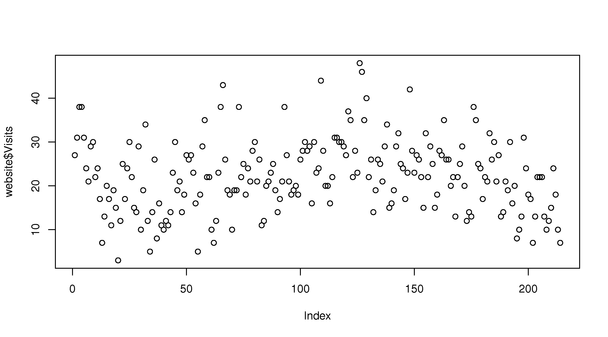

That plot shows only the points (markers), in the order of the data set.  What if you want lines between the points?  Type ``help(plot)`` to find out more about the ``plot`` command.  For example, it tells you there that ``type="p"`` will just show the points (the default setting for ``plot``): 

.. code-block:: s
	
	plot(website$Visits, type="p")

If you use ``type="l"`` you get a line plot:

.. code-block:: s
	
	plot(website$Visits, type="l")

and ``type="b"`` will show both lines and points, leaving a space between the point and the line connections

.. code-block:: s
	
	plot(website$Visits, type="b")
	
and ``type="o"`` will connect (overplot) the lines and points.  

Box plots
--------------------

The basic boxplot syntax is:

.. code-block:: s

	boxplot(website$Visits)

To get boxplots for each day of the week, side-by-side we rely on the fact the column, ``DayOfWeek``, is a categorical variable.  R calls these ``factor`` variables, and you can confirm this:  ``is.factor(website$DayOfWeek)`` returns ``TRUE``.  We can then tell the ``boxplot`` command to group the boxplots by a factor variable:

.. code-block:: s

	boxplot(website$Visits ~ website$DayOfWeek)

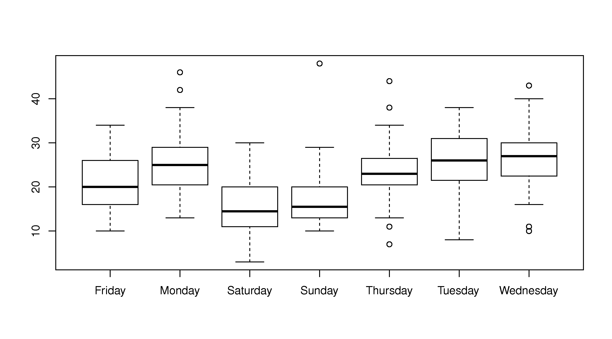

Read the help text, ``help(boxplot)``, and ``help(factor)`` in order to understand more clearly how this plot was generated.

Plots with multiple series, colour, and legends
==================================================

There are cases when we might need to overlay more than one *series*.  A *series* is a sequence of values on the plot, sometimes also called a *trajectory*.  We might choose to show each series in a different colour, or use a different marker shape.  Finally, we'd like to add a legend to the plot.

Let's look at a dataset, ``brittleness-index``, `available here <http://datasets.connectmv.com/info/brittleness-index>`_, which contains the data where a single quantity of raw materials was split into 3 parts.  Each part is processed in a different reactor, TK104, TK105, and TK107.  The data are the final brittleness values from the product produced in the reactor.

We'd like to plot the three series *on the same plot*. 

Plot the first series
----------------------

.. code-block:: s
	
	brittle <- read.csv('http://datasets.connectmv.com/file/brittleness-index.csv')

	summary(brittle)
	    TK104           TK105           TK107      
	Min.   :188.0   Min.   :223.0   Min.   :240.0  
	1st Qu.:369.5   1st Qu.:370.0   1st Qu.:425.0  
	Median :423.5   Median :460.0   Median :479.0  
	Mean   :421.0   Mean   :472.2   Mean   :470.1  
	3rd Qu.:482.2   3rd Qu.:549.0   3rd Qu.:548.5  
	Max.   :697.0   Max.   :709.0   Max.   :733.0  
	NA's   :  3.0   NA's   :  2.0
	
	plot(brittle$TK104,  type="l", col="red")
	
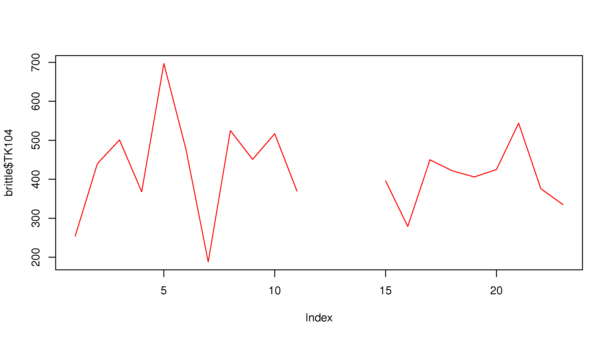

Note the gap in the plot because the ``TK104`` variable has missing values, as shown in the ``summary`` output: there are 3 ``NA`` (not available) entries in the data set.  Also note that we can set the line colour using the ``col`` input.  

Type ``colours()`` to see a list of all available colours in R.

Next, superimpose the other series
----------------------------------

Adding the remaining two series is done using the ``lines`` command.  The ``lines`` command cannot be used to *start* a new plot: it is only used to add to an existing ``plot``.
	
	
.. code-block:: s

	plot(brittle$TK104,  type="l", col="red")
	lines(brittle$TK105, type="l", col="black")
	lines(brittle$TK107, type="l", col="darkgreen")
	
which gives the following plot:

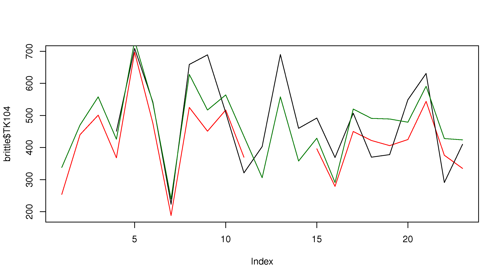

This looks OK, but there are two main issues: the y-axis limits are not large enough to accommodate the series (notice how it chops off at the top), and the y-axis label needs to be adjusted.  Also the x-axis label can be improved.

Adjusting axis labels
----------------------

Axis labels are specified using the ``plot(..., xlab="X-axis label", ylab="Y-axis label")`` syntax.  

.. code-block:: s

	plot(brittle$TK104,  type="l", col="red", xlab="Sequence order of batches", 
	                                                 ylab="Brittleness values")
	lines(brittle$TK105, type="l", col="black")
	lines(brittle$TK107, type="l", col="darkgreen")

The result is shown in the next subsection.

Adjusting axis limits
----------------------

Axis limits may be specified manually, if you know what they are:

.. code-block:: s

	plot(brittle$TK104,  type="l", col="red", xlab="Sequence order of batches", 
		                            ylab="Brittleness values", ylim=c(180, 740))
	lines(brittle$TK105, type="l", col="black")
	lines(brittle$TK107, type="l", col="darkgreen")
	
or you can calculate them automatically, with a bit of extra code.  One of several possible ways is:

.. code-block:: s

	rng.104 <- range(brittle$TK104, na.rm=TRUE)  # calculate the ranges first
	rng.105 <- range(brittle$TK105, na.rm=TRUE)
	rng.107 <- range(brittle$TK107, na.rm=TRUE)
	
	# then take the extremes of each range
	ylim <- c(min(rng.104, rng.105, rng.107), max(rng.104, rng.105, rng.107))
	
	plot(brittle$TK104,  type="l", col="red", xlab="Sequence order of batches",
	                                          ylab="Brittleness values", ylim=ylim)
	lines(brittle$TK105, type="l", col="black")
	lines(brittle$TK107, type="l", col="darkgreen")
	
The result is:

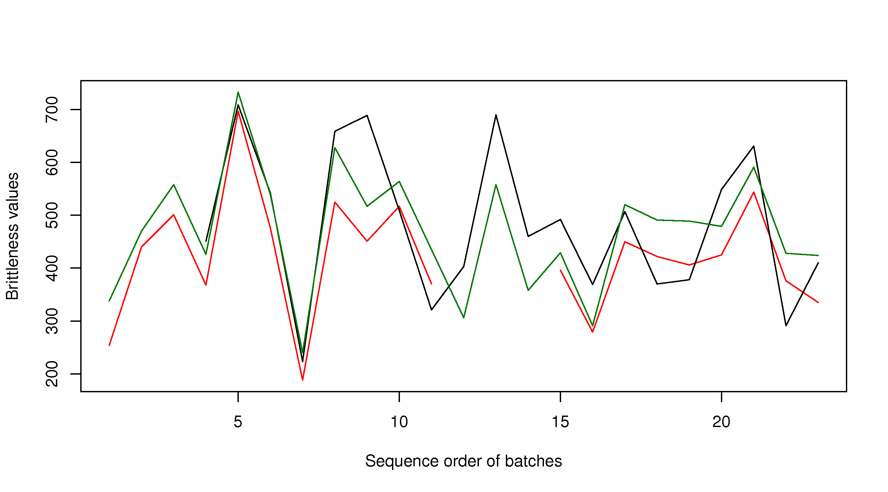

.. _r-other-plot-options:

Other plot input options
-------------------------

You can see the full list of input options to the ``plot`` command by typing ``help(plot.default)``.  Other options of interest are:

``type``
  	A single character indicating the type of plot: "p" for points, "l" for lines, "o" for overplotted points and lines, "s" and "S" for stair steps and "h" for histogram-like vertical lines. 

	An interesting option is ``"n"`` which just creates an empty axis, but does not add any points or lines.

``xlim`` and ``ylim``
	Each a 2-entry list indicating the extent of the x- and y-axes.  If the entries are reversed, then the plot axis is reversed.

``log``
	A character string: ``"x"`` if the x axis is to be logarithmic, ``"y"`` if the y axis is to be logarithmic and ``"xy"`` if both axes are to be logarithmic.

``main``	
	The main title for the plot; also see ``help(title)``.

``xlab`` and ``ylab``
	 Labels for the x- and y-axes.
	
``ann = FALSE``
	Will turn off the default ANNotations: title and x and y axis labels.
	
``axes``, ``xaxt``, ``yaxt``
 	Set to ``TRUE`` or ``FALSE`` to suprress both axes or just one of the axes.

``asp``
	Set the plots y/x aspect ratio; see ``help(plot.window)`` for more information.

Adding a legend
----------------

A legend is added afterwards using the 

``legend(x=..., y=..., legend=c("Entry 1", "Entry 2", ...) )`` form of the ``legend`` function, where

``x`` and ``y``
	is the ``(x,y)`` location of the legend in the plot
	
``legend = c(...)``
	is a list of strings that contains the legend text
	
But we need to also tell the legend function what type of line and colour to show with the text.  A full example, with the resulting figure is shown below.

.. code-block:: s

	plot(brittle$TK104,  type="l", col="red", ylim=ylim, ylab="Brittleness values",
	                                                     xlab="Sequence order")
	lines(brittle$TK105, type="l", col="black")
	lines(brittle$TK107, type="l", col="darkgreen")
	legend(x=15, y=720, legend=c("TK104", "TK105", "TK107"), lwd=2,
	                    col=c("red", "black", "darkgreen"))
	
.. ucomment:: L74MEQ: nu, ex, kc,

Note that there should be a colour specification for each entry in the legend.  The ``lwd`` input argument is the line width used in the legend.  If you omit this, then you will only get legend labels.  Also notice that we only need to specify it once: R will cycle the value of ``2`` over and over for every legend entry.
	
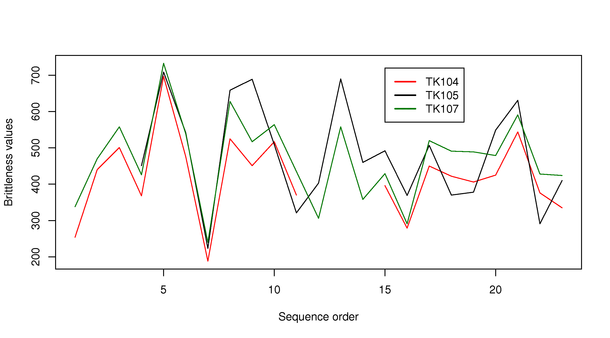
	
Saving your plots 
------------------

Once you have drawn your plot, you can go to the menu on the top, and click ``File``, then ``Save as``.  For example, on Mac systems, this allows you to save the plot as a PDF that can be included into another document.

In many cases it is easier to write code to save the plot; that way, when you run your R-script, it saves the plot automatically to your hard drive.  Proceed as follows:

.. code-block:: s

	bmp(file='../images/name-of-file.bmp')
	
	# various plotting commands go here
	# Add all your labels, etc
		
	dev.off()

The above code shows that you must surround your plot with the ``bmp(...)`` function, and terminate it with ``dev.off()``.  Similar versions of this function exist for

*	``png`` files: use the ``png(...)`` function
*	``jpg`` files: use the ``jpeg(...)`` function
*	``pdf`` files: use the ``pdf(...)`` function

**Advanced users**

	Plots in this tutorial are saved using the ``bitmap(...)`` function.  This required *quite a bit more work* to set up, and the instructions below are for a Mac system.  The files can be saved to any format, and the figures often look clearer (in my opinion).

	*	Install Ghostscript.

	*	Edit your R settings file to tell it where your Ghostscript instance is:

		.. code-block:: s

			# For 32-bit systems
			nano /Library/Frameworks/R.framework/Versions/Current/Resources/etc/i386/Renviron
		
			# For 64-bit systems
			nano /Library/Frameworks/R.framework/Versions/Current/Resources/etc/x86_64/Renviron
	
			# and set the following line to point to Ghostscript
			R_GSCMD=${RGSCMD-'/sw/bin/gs'}
		
	*	Verify the settings in R: ``Sys.getenv("R_GSCMD")``
	
	*	Surround your plotting code with ``bitmap(...)`` and ``dev.off()`` commands as shown above.

Histograms
===========

Use the ``hist(...)`` command to both *calculate* and *plot* the histogram for a univariate data sequence.  This section demonstrates both aspects.

.. code-block:: s

	rm <- read.csv('http://datasets.connectmv.com/file/raw-material-properties.csv')

	# Plot the histogram for the "density2" variable in the data:
	hist(rm$density2)

You will get this plot:

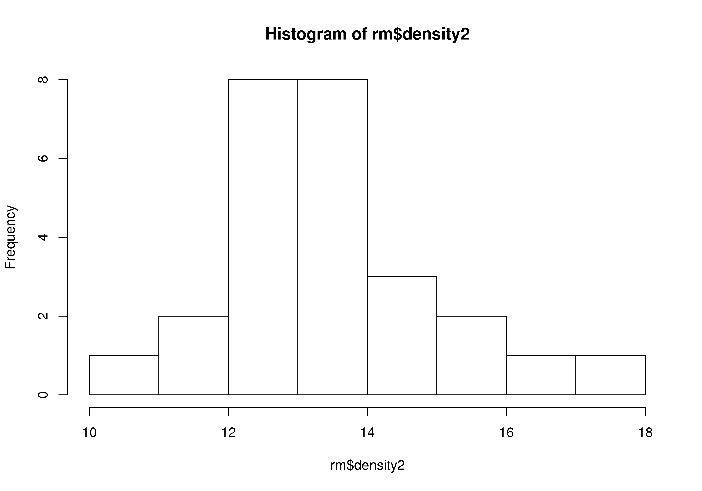
	
You can change the axis labels and the main title by using the :ref:`usual plot arguments <r-other-plot-options>` described earlier.
	
The ``hist(...)`` command also returns a whole lot more information, in addition to drawing the plot, but only if you first create a variable:

.. code-block:: s

	density2.hist <- hist(rm$density2)
	density2.hist
	$breaks
	[1] 10 11 12 13 14 15 16 17 18

	$counts
	[1] 1 2 8 8 3 2 1 1

	$intensities
	[1] 0.03846153 0.07692308 0.30769231 0.30769231 0.11538462 0.07692308 0.03846154 0.03846154

	$density
	[1] 0.03846153 0.07692308 0.30769231 0.30769231 0.11538462 0.07692308 0.03846154 0.03846154

	$mids
	[1] 10.5 11.5 12.5 13.5 14.5 15.5 16.5 17.5

	$xname
	[1] "rm$density2"

	$equidist
	[1] TRUE

	attr(,"class")
	[1] "histogram"

The above output shows where the bin edges (``breaks``) and bin midpoints (``mids``) were automatically calculated and the number of entries (``count``) in each bin.  The ``density`` value is just ``counts/N``, in other words, the relative frequency.  You could access the count data, for example, directly as:

.. code-block:: s

	density2.hist$counts
	[1] 1 2 8 8 3 2 1 1

.. rubric:: Summary

*	The frequency histogram: just use ``hist(...)``
*	The *relative* frequency histogram, which is normalized to unit area: ``hist(rm$density2, freq=FALSE)``

Annotating plots: grid lines, arrows, lines, and identifying interesting points
================================================================================

This part uses the `same dataset <http://datasets.connectmv.com/info/raw-material-properties>`_ from the previous section.

Grid lines
----------

If we plot the ``density2`` value in sequence order:

.. code-block:: s

	rm <- read.csv('http://datasets.connectmv.com/file/raw-material-properties.csv')
	plot(rm$density2)

	# We can add gridlines to the plot:
	grid()

Adding lines to a plot
---------------------------

Now, imagine we want to add a horizontal line at the sample *median*.

.. code-block:: s

	median(rm$density2)
	[1] NA

That isn't what we were expecting - why is the median given as "NA"?  In R, the NA stands for a missing value. The ``rm$density2`` data sequence has several missing values.  To force R to calculate the median, but ignoring missing values, use this:

.. code-block:: s

	density2.median <- median(rm$density2, na.rm=TRUE)
	density2.median
	[1] 13.21

	# Now to add a horizontal line at this value:
	plot(rm$density2)
	abline(h=density2.median)

	# You can add a vertical line using the "v" input option.
	# The "col" argument (option) gives the desired colour.
	abline(v=25, col="red")

So the ``abline`` function adds vertical and horizontal lines to a plot.  You can also add sloped lines, by specifying the slope and intercept: use the ``abline(a=..., b=...)`` syntax.

At this point you should have the following output:

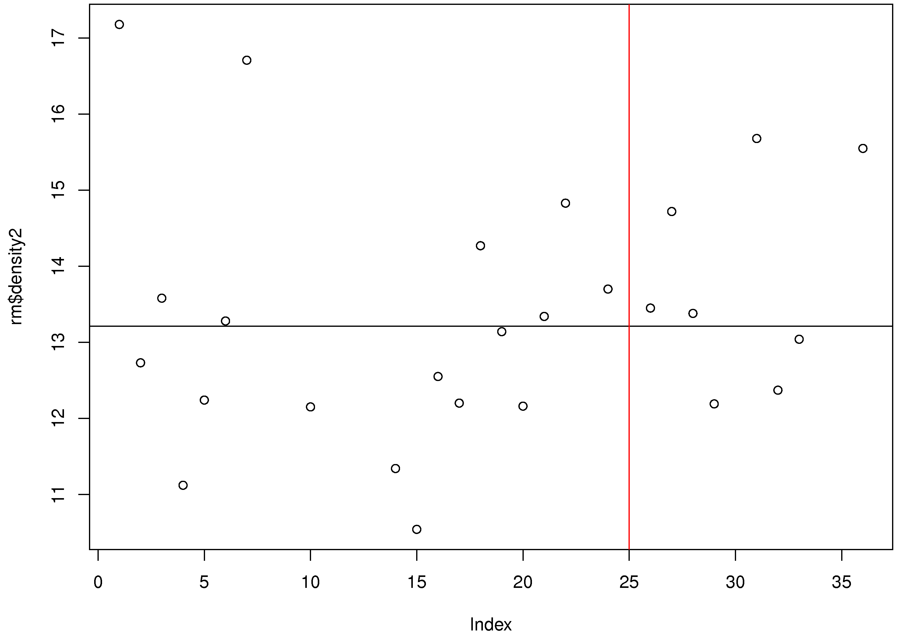

Arrows and text
---------------------------

You can also add arrows and text.  For example, these commands will draw an arrow from the median to the MAD and add some text next to the arrow:

.. code-block:: s

	density2.mad = mad(rm$density2, na.rm=TRUE)

	# What are the y-values that are 1 median absolute deviation away from the median?
	upper = density2.median + density2.mad  # 14.71484
	lower = density2.median - density2.mad  # 11.70516

	# Now add these as horizontal lines:
	abline(h=upper, col="gray80")
	abline(h=lower, col="gray80")

	# Now draw an arrow at x=10, that goes from y=median to y=median+mad
	# The (x0, y0) is the starting coordinate
	# The (x1, y1) is the ending coordinate
	# The code=3 indicates that arrows heads are drawn on both sides.  Also try codes 0, 1, and 2

	arrows(x0=10, y0=density2.median, x1=10, y1=density2.median+density2.mad, code=3)

	# Finally, let's add some text to the plot at the point (x=13, y=14)
	text(x=13, y=14, labels="One MAD")

This is the plot you should have after these steps:

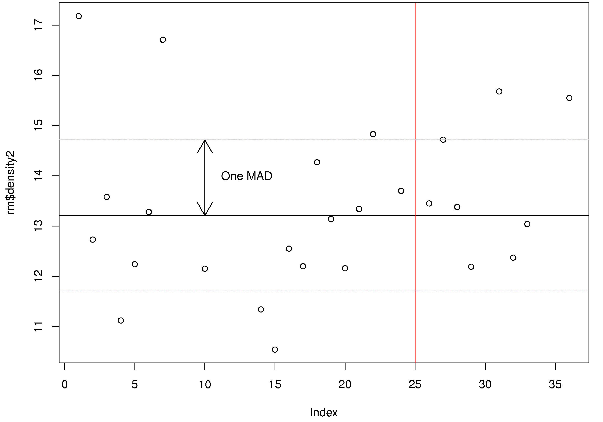

Identifying interesting points in a plot
-----------------------------------------

A plot should be like a paragraph of text: it should stand on its own and tell the reader something.  To help with this, it is often necessary to label  interesting points on a plot, not necessarily every point.

We will first plot some data, then add labels to interesting points using the ``identify(...)`` command in R:

.. code-block:: s
	
	# Read in some data
	rm <- read.csv('http://datasets.connectmv.com/file/raw-material-properties.csv')  

	# Plot the data as you normally would
	plot(rm$size2, ylab="Particle size: level 2", main="Powder raw material")

	# Now use the identify(...) command, with the same data as you plotted. 
	# Add the "labels" option to let R use label names from "Sample" column.

	identify(rm$size2, labels=rm$Sample)

	# After issuing the "identify(...)" command, click on any interesting points in the 
	# plot.  Right-click anywhere to stop selecting points.

For example, I selected these interesting points in the plot, then in my technical report to my manager and I can refer to those points.

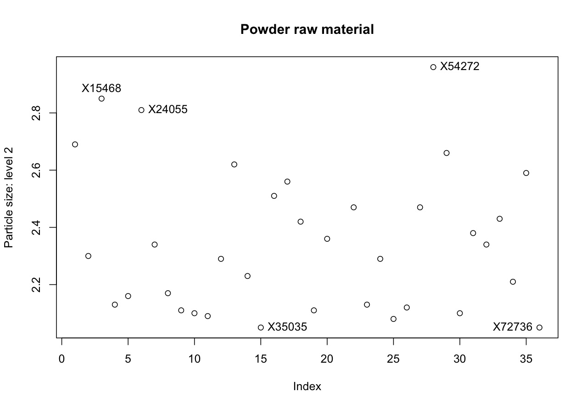

Dealing with factors (categorical variables)
==============================================

This section shows a bit about R's ability to deal with factors.  Factors are variables that are coded for categories: e.g. ``male`` and ``female``, or another example could be day of the week: ``Monday, Tuesday, ..., Sunday``.

When you loaded the website data, not all of the raw data (take a look inside the CSV file) is numeric.  The ``DayOfWeek`` is text, so R assumes this is a factor.  It automatically goes and finds all unique values in that column (the names of the 7 days in the week in this case), and codes that as factor variable.  But it sorts them alphabetically, ``Friday, Monday, ..., Wednesday``.  If you want them in a different order, use the ``levels`` input option to tell R your preferred order:

.. code-block:: s
	
	day.names <- c("Monday", "Tuesday", "Wednesday", "Thursday", "Friday", "Saturday", "Sunday" )
	days <- factor(website$DayOfWeek, level=day.names)
	boxplot(website$Visits ~ days)

Now that boxplot will be ordered in a more useful way to see the weekly trends:

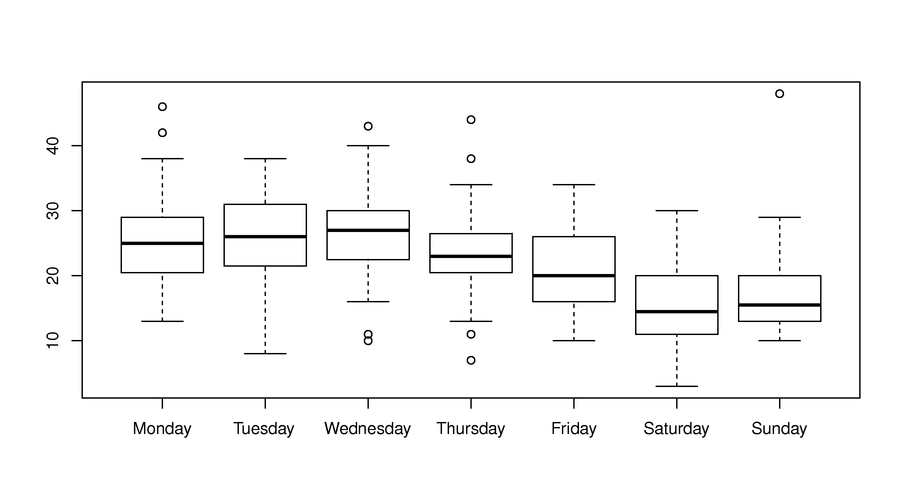

The ``c()`` command creates a combination of items and the ``factor()`` command creates a factor variable.

Calculating statistics from a data sample
==================================================

Load a data set, for example the `Website traffic <http://datasets.connectmv.com/info/website-traffic>`_ data:

.. code-block:: s

	# Over the internet
	website <- read.csv('http://datasets.connectmv.com/file/website-traffic.csv')  
	
	# or from your hard drive
	website <- read.csv('C:/StatsCourse/Data/website-traffic.csv')                 
	
	
	# Take a quick look at the data to make sure it's what we expect ...
	summary(website)
	     DayOfWeek        MonthDay        Year          Visits     
	 Friday   :30    August 1 :  1   Min.   :2009   Min.   : 3.00  
	 Monday   :31    August 10:  1   1st Qu.:2009   1st Qu.:16.25  
	 Saturday :30    August 11:  1   Median :2009   Median :22.00  
	 Sunday   :30    August 12:  1   Mean   :2009   Mean   :22.23  
	 Thursday :31    August 13:  1   3rd Qu.:2009   3rd Qu.:27.75  
	 Tuesday  :31    August 14:  1   Max.   :2009   Max.   :48.00  
	 Wednesday:31   (Other)   :208

	# Calculate the mean of the "Visits" column:
	visits <- website$Visits
	visits.mean <- mean(visits)
	visits.mean
	[1] 22.23364

	# The standard deviation: use sd(...)
	visits.sd <- sd(visits)
	visits.sd
	[1] 8.331826

	# How do the robust equivalents compare?
	visits.median = median(visits)
	visits.mad = mad(visits)
	c(visits.median, visits.mad)
	[1] 22.0000  8.8956

You can use these additional R commands to compute other summaries of interest for a sequence of data:

.. code-block:: s

	# The sum
	sum(visits)
	[1] 4758

	# The minimum and maximum
	c(min(visits), max(visits))
	[1]  3 48

	# Or just use the range(...) command to get the same result
	range(visits)
	[1]  3 48

	# The summary(...) command we saw earlier gives all this, as well as the 
	# 1st and 3rd quartiles.  Here's another way to summarize a variable:
	quantile(visits)
	   0%   25%   50%   75%  100% 
	 3.00 16.25 22.00 27.75 48.00 

	# It gives the 0, 0.25, 0.50, 0.75 and 1.00 sample quantiles at those 
	# probabilities.  If you want to specify your own probability:
	quantile(visits, 0.32)
	32% 
	 18

	# So 32% of the observations in this data recored a value of 18 or 
	# fewer visits to the website.

	# Recall the interquartile range is the distance from the 3rd to the 1st quartile:
	visits.iqr <- quantile(visits, 0.75) - quantile(visits, 0.25)  # 11.5

	# or, you can calculate it more directly using the IQR(...) function:
	visits.iqr <- IQR(visits)  # 11.5

	# Type help(IQR) to see how to compare the IQR to the 2 other measures of spread: 
	# the standard deviation and the median absolute deviation (MAD)

Dealing with distributions
===========================

Values from various distribution functions are easily calculated in R. 

Direct probability from a distribution
----------------------------------------

To calculate the probability value directly from *any* distribution in R you use a function created by combining ``d`` with the name of the distribution, that is what is meant by ``dDIST`` in the illustration here:

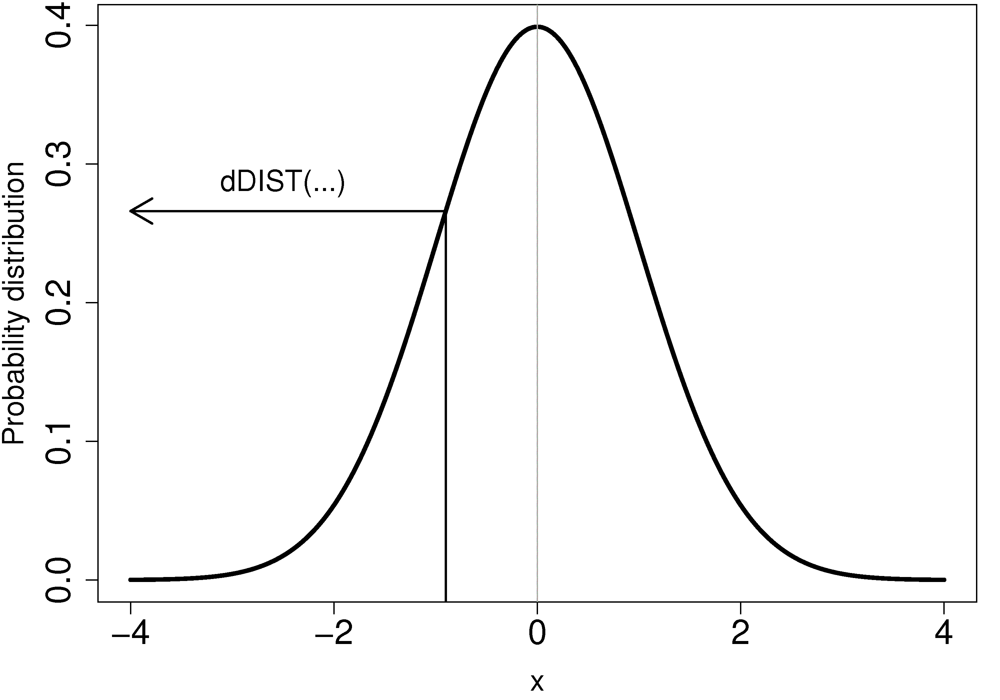

For the *normal* distribution:
	``dnorm(x=...)`` 
	
	For example, ``dnorm(1)`` returns 0.2419707, the point of inflection on the normal distribution curve.
	
For the :math:`t` distribution:
	``dt(x=..., df=...)`` where ``df`` are the degrees of freedom in the :math:`t`-distribution

For the :math:`F`-distribution:
	``df(x=..., df1=..., df2=...)`` given the ``df1`` (numerator) and ``df2`` (denominator) degrees of freedom.
	
For the chi-squared distribution:
	 ``dchisq(x=..., df=...)``  given the ``df`` degrees of freedom.

Values from the cumulative and inverse cumulative distribution
----------------------------------------------------------------

Similar to the above, we call the function by combining ``p`` - to get the cumulative percentage area under the distribution, and ``q`` - to get the quantile.

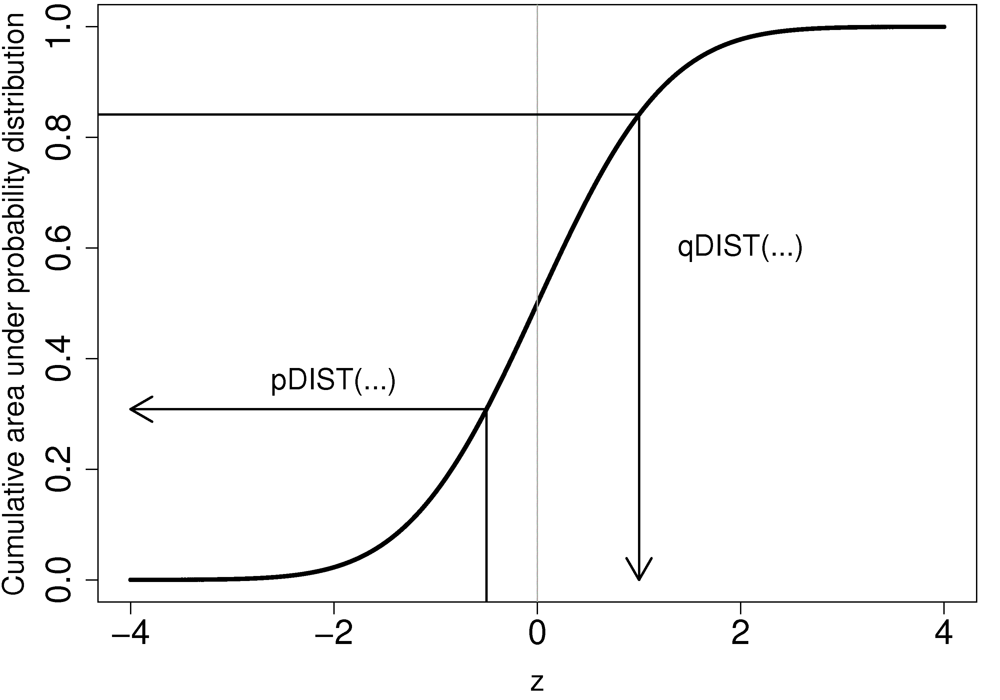

*	For the *normal* distribution: ``pnorm(...)`` and ``qnorm(...)``

*	For the :math:`t`-distribution: ``pt(...)`` and ``qt(...)``

*	For the :math:`F`-distribution: ``pf(...)`` and ``qf(...)``
	
*	For the chi-squared distribution: ``pchisq(...)`` and ``qchisq(...)``

Obtaining random numbers from a particular distribution
---------------------------------------------------------

To obtain a single random number from the normal distribution with mean of 0 and standard deviation of 1.0:

.. code-block:: s

	rnorm(1)
	[1]  -0.3451397

For example, to obtain 10 random, normally distributed values:

.. code-block:: s

	rnorm(10)
	[1]  0.4604076 -0.9670948 -0.2624246 -0.2223866  0.2492692
	[6]  0.7160273 -0.2734768  2.4437870  0.4269511 -0.4831478
	
where the ``r`` prefix indicates we want random numbers.

Notice that R has used a default value of ``mean=0`` and *standard deviation* ``sd=1``.  If you'd like your random numbers centred about a different mean, with a different level of spread, then:

.. code-block:: s

	rnorm(n=10, mean=30, sd=4)
	[1] 31.62686 37.83101 28.07470 20.95000 30.47500
	[6] 28.21797 35.81518 28.61481 30.59083 32.94051

Please pay attention to the fact that this function accepts the *standard deviation* and not the variance.  In the previous example, the usual notation in statistics is to say :math:`x \sim \mathcal{N}(30, 16)` that is, we specify the variance, but the random number generator requires you specify the standard deviation.

*	For the :math:`t` distribution: ``rt(...)``

*	For the :math:`F`-distribution: ``rf(...)``

*	For the chi-squared distribution: ``rchisq(...)``

Extending R with packages
============================

The basic R installation is pretty comprehensive.  One of the advantages of R though is that it is constantly being updated with new packages.  A package is collection of functions and other information that expand R's capabilities.  

For example, the built-in ``qqnorm(...)`` can be used to test if a sequence of values came from a normal distribution.  However, there is, in my opinion, a better qq-plot function in the ``car`` library, called ``qqPlot(...)``, however the ``car`` library does *not* come pre-installed with R.

This section shows how to install extra packages and to keep your R installation up to date.

Keeping R up to date
-----------------------

Even if you don't want to install extra packages, you should keep the built-in packages up to date.  You require an internet connection for this step.

At the R command prompt, write:

.. code-block:: s

	update.packages()

.. rubric:: Mac users

*	Click on ``Packages & Data`` on the top menu
*	Choose ``Package Installer``
*	Click ``Get list``
*	If this is your first time updating, then you will have to select the closest update mirror (web site).  
*	Typically you would choose the mirror that is geographically closest to you: for example ``Canada (ON)``.  You can have R remember your choice for the future.
* Click on the ``Update All`` button to have R check that your built-in packages are up to date at the latest version. 

.. rubric:: Windows users

*	Click on ``Packages`` on the top menu
*	Choose ``Update packages``
*	If this is your first time updating, then you will have to select the closest update mirror (web site).  
*	Typically you would choose the mirror that is geographically closest to you: for example ``Canada (ON)``.  You can have R remember your choice for the future.
*	Click ``OK`` once it shows you the list of packages that will be updated.

R will fetch and install any updates it requires.

..  _r-installing-packages:

Installing a new package
--------------------------

Installing a new package is easy; finding the package to install that does what you want is a little tougher: there are over 2000 packages available.  Here are 2 ways I typically discover packages.

#.	By browsing the hierarchy of packages at http://cran.r-project.org/web/views/
#.	Googling: for example, the other day I needed to figure out how to plot time-series data nicely.  I came across a page that recommended the ``xts`` package.

.. rubric:: Mac users

*	Click on ``Packages & Data`` on the top menu
*	Choose ``Package Installer``
*	Click ``Get list``
*	Select the packages from the list (you can select more than one by holding down the ``Command`` key on a Mac).
*	Make sure you select the check box ``Install dependencies``
*	Then click "Install Selected"

.. rubric:: Windows users

*	Click on ``Packages`` on the top menu
*	Choose ``Install packages``
*	Select the package(s) you wish to install 
*	Click ``OK``

Once the library is installed, you first need to load it.  For example, to generate a nicer qq-plot using the ``car`` package:

.. code-block:: s

	data <- rnorm(100)  # create 100 normally distributed values
	library(car)
	qqPlot(data)
	
.. ucomment:: H7Xatt: Xg, 6x*, Bj,

will generate:

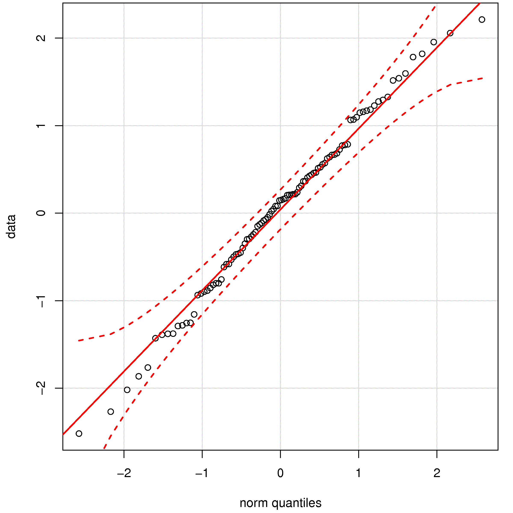

To see a list of all functions that are provided by a package:

.. code-block:: s

	help(package="car")
	
.. r-programming-loops

Programming in R: loops and flow control
=========================================

R is also a general programming language.  This section is a *very* brief introduction to creating ``for`` loops, and ``if-else`` flow control.

.. _r-programming-loops-for-loop:

For loops
-----------

A ``for`` loop will repeat a chunk of code a certain number of times.  The number of times it will execute is determined by the *looping variable*. In this example we calculate the average of 100 uniformly distributed random numbers, and display that average 4 times (the looping variable is ``1, 2, 3, 4``).

.. code-block:: s

	n_loops <- 4
	for (i in 1:n_loops)
	{
	    # 100 uniformly distributed numbers between 1 and 6
	    x <- as.integer(runif(100, 1, 7))
	    print(mean(x))
	}
	# Printed output
	[1] 3.58
	[1] 3.67
	[1] 3.13
	[1] 3.71

The looping variable, called ``i`` in the above example, started at ``1`` and ended at ``n_loops``.  But we can use an arbitrary sequence of numbers in a vector to loop on:

.. code-block:: s
	
	# You can put the opening brace for the loop one line
	# up, if you prefer. Compare to previous example.
	
	for (i in seq(2, 10, 3)){
	    print(i)
	}
	# Printed output
	[1] 2
	[1] 5
	[1] 8
	
	# We can create the vector ahead of time
	idx <- c(2, 5, 7, 3, 1)	
	
	# One-line for-loops can be written more compactly
	# but may become hard to read and debug
	for (i in idx)  print(i)
	
	# Printed output
	[1] 2
	[1] 5
	[1] 7
	[1] 3
	[1] 1
	
Most often though we want to store the results of our ``for``-loop calculation.  You might want to read the section on creating empty :ref:`vectors and matrices <r-vectors-matrices>` first and then come back here.

Returning back to the previous example: let's say we want to store the mean values from the uniform distribution, instead of printing them to the screen:

.. code-block:: s

	n_loops <- 10
	x.means <- numeric(n_loops)  # create a vector of zeros to store the results in
	for (i in 1:n_loops){
	    x <- as.integer(runif(100, 1, 7))  # uniformly distributed numbers between 1 and 6
	    x.means[i] <- mean(x)
	}	
	x.means
	
	# Printed output
	[1] 3.21 3.73 3.41 3.61 3.39 3.91 3.60 3.32 3.52 3.49

.. While loops

	A ``while`` loop while execute the chunk of code as long as the condition in the loop is true.  A ``while`` loop can run an infinite number of times if poorly coded, or may run zero times (intentionally).

if-else flow control loops
---------------------------

Branching your code (controlling its flow) using if-else blocks is given by this syntax in R:

.. code-block:: s

	if (...condition 1...){
	     .... statements ....
	}
	elseif(...other condition 2...){
	     .... other statements ....
	}
	elseif(...other condition etc...){
	     .... more statements ....
	}	
	else{
	     .... and yet more statements ....
	}
	
	
..	Comments
	
	_r-programming-functions:

	Programming in R: functions
	
	Example:
	
	# We are going to repeatedly have to calculate the phase 1 limits.  Create a function.
	shewhart_limits <- function(xbar, S, subgroup.size, N.stdev=3){
	    # Give the xbar and S vector containing the subgroup means and standard deviations.
	    # Also give the subgroup size used.  Returns the lower and upper control limits
	    # for the Shewhart chart (UCL and LCL) which are N.stdev away from the target.

	    x.double.bar <- mean(xbar)     
	    s.bar <- mean(S)
	    an = c(NA, 0.793, 0.886, 0.921, 0.940, 0.952, 0.959, 0.965)
	    LCL <- x.double.bar - 3*s.bar/an[subgroup.size]/sqrt(subgroup.size)
	    UCL <- x.double.bar + 3*s.bar/an[subgroup.size]/sqrt(subgroup.size)
	    c(LCL, UCL)

	return(list(LCL, x.double.bar, UCL))
	}
	

.. _r-vectors-matrices:

Vectors and matrices
=====================

Creating matrices and vectors 
-------------------------------------------

An vector of zeros is created using the ``numeric`` function.  This is used, for example, to initialize a vector of zeros before calling a :ref:`for loop <r-programming-loops-for-loop>` to fill the entries in that vector.  This is called *preallocation*, and is good programming practice in any language: rather preallocate the matrix for storage than incrementally add entries to an existing matrix.

.. code-block:: s

	numeric(6)
	[1] 0 0 0 0 0 0
	
A matrix or vector can be created using the ``matrix`` function.  The advantage of the ``matrix`` function is that it can set the values to a non-zero, or missing values (``NA``):

.. code-block:: s

	# Matrix of zeros:
	matrix(data=0, nrow=2, ncol=3)
	     [,1] [,2] [,3]
	[1,]    0    0    0
	[2,]    0    0    0
	
	# Column vector of missing values:
	matrix(nrow=4)
	     [,1]
	[1,]   NA
	[2,]   NA
	[3,]   NA
	[4,]   NA
	
	# Row vector of seven 7's
	matrix(data=7, ncol=7)
	     [,1] [,2] [,3] [,4] [,5] [,6] [,7]
	[1,]    7    7    7    7    7    7    7
	
I prefer to allocate matrices with missing entries, ``NA``, because it is easy to check after the loop if you have missed any entries. For example, for matrix ``X``, we can check: ``any(is.na(X))``
	
There is yet another way to create a matrix or vector of only *zero entries*:

.. code-block:: s

	# 3x1 vector of zeros
	mat.or.vec(3, 1)
	
	# 2x3 matrix of zeros
	mat.or.vec(2, 3)
	
	
Creating a matrix from several vectors
-------------------------------------------

If you have a some equal-length vectors you might want to stack them together to create a matrix.

Stacking vectors side-by-side: ``cbind`` 
~~~~~~~~~~~~~~~~~~~~~~~~~~~~~~~~~~~~~~~~~~

The ``cbind`` function will put each vector in a column and return the matrix.  Let's say we wanted to use only a subset of the columns from a given data frame:

.. code-block:: s

	bio <- read.csv('http://datasets.connectmv.com/file/bioreactor-yields.csv')
	bio
	   temperature duration speed baffles yield
	1           82      260  4300      No    51
	2           90      260  3700     Yes    30
	..         ...      ...  ....     ...    ..
	13         101      260  4400      No    42
	14          92      260  4900     Yes    38
	
	data <- cbind(bio$temperature, bio$ speed)
	data
	      [,1] [,2]
	 [1,]   82 4300
	 [2,]   90 3700
	.....  ... .... 
	[13,]  101 4400
	[14,]   92 4900

Stacking top-to-bottom: ``rbind``
~~~~~~~~~~~~~~~~~~~~~~~~~~~~~~~~~~~~~~~~~~

Use the ``rbind`` function to join existing matrices or vectors, one on top of another:

Create a matrix with 2 rows and 4 columns filled with random numbers, and another matrix containing 3 rows and 4 columns, filled with the number 2.6.  Then to stack them:

.. code-block:: s
	
	X <- matrix(rnorm(2*4), 2, 4)
	Y <- matrix(data=2.6, nrow=3, ncol=4)

	rbind(X,Y)
	
	          [,1]       [,2]       [,3]        [,4]
	[1,] 0.6096289 -0.3730975 -1.0376647 -0.01033531
	[2,] 0.6305808 -0.6768284  0.4918309 -0.44430265
	[3,] 2.6000000  2.6000000  2.6000000  2.60000000
	[4,] 2.6000000  2.6000000  2.6000000  2.60000000
	[5,] 2.6000000  2.6000000  2.6000000  2.60000000

Reshaping a vector into a matrix
-------------------------------------------

.. TODO:KGD : link to PID book here later on

There are occasions when we need to create subgroups of data from a vector. This happens, for example, when constructing control charts:

*	we need to create the subgroups from *non-overlapping* segments in the vector
*	we need to do calculations on these subgroups

One way to construct the subgroups is to use 2 nested :ref:`for-loops <r-programming-loops-for-loop>` to extract the necessary data.  This works, but can get messy.  There is an alternative way: by rearranging your vector into a matrix and then doing your calculations on each column of the matrix.

Let the raw data be given by this random vector:

.. code-block:: s

	N.raw = 5000 
	raw <- rnorm(N.raw, mean=220, sd=50)  
	plot(raw)

Let's say our subgroup size is 9.  Now 5000 is not neatly divisible by 9, but this doesn't matter.  We create a matrix with 9 rows and as many columns as we can (roughly 5000/9).

.. code-block:: s
	
	N.sub = 9
	subgroups <- matrix(raw, N.sub, N.raw/N.sub)
	# Warning message:
	# In matrix(raw, N.sub, N.raw/N.sub) :
	#   data length [5000] is not a sub-multiple or multiple of the number of rows [9]

Notice that R gives a warning, not an error message.  You can see what size matrix it created: 9 rows and 555 columns, so there are 4995 elements in the array.  That's usually good enough: we throw away the last 5 entries that don't form a complete subgroup.

.. code-block:: s
	
	dim(subgroups)
	[1]   9 555  
	
	nrow(subgroups)
	[1] 9

The next step is to calculate the mean and standard deviation of each subgroup, i.e. for each column in the new matrix.  For that we will use the ``apply(...)`` command, which applies any R function to a matrix along a particular direction.

*	``apply(X, 1, sd)`` will apply the ``sd`` function to matrix ``X`` across the row direction (that's what the ``1`` is for: the first dimension)
*	``apply(X, 2, sd)`` will apply the ``sd`` function to matrix ``X`` across the column direction (that's what the ``2`` is for: the second array dimension)

In our example the subgroups appear in each column.  So calculate the standard deviation and mean for each column:

.. code-block:: s

	subgroups.S <- apply(subgroups, 2, sd)
	subgroups.xbar <- apply(subgroups, 2, mean)

	length(subgroups.S)
	[1] 555
	
	# "subgroups.S" is not a matrix, so the "dim" function isn't valid
	dim(subgroups.S)
	NULL
	
**Note**: there are built-in R functions, called ``colMeans(X)`` and ``rowMeans(X)`` which will perform the specific task of applying the ``mean`` function along the column or row direction.  The ``apply`` function is more general though.

Matrix operations
-------------------------------------------------

Once you've got your matrices created it is time to work with them: addition and subtraction, multiplication, transposes, inverses and determinants can all be calculated in R.

Matrix addition and subtraction
~~~~~~~~~~~~~~~~~~~~~~~~~~~~~~~~~~~~~~~~~~

.. code-block:: s

	X <- matrix(data=56, nrow=4, ncol=5)
	Y <- matrix(data=32, nrow=4, ncol=5)
	X+Y
	     [,1] [,2] [,3] [,4] [,5]
	[1,]   88   88   88   88   88
	[2,]   88   88   88   88   88
	[3,]   88   88   88   88   88
	[4,]   88   88   88   88   88

	X-Y
	     [,1] [,2] [,3] [,4] [,5]
	[1,]   24   24   24   24   24
	[2,]   24   24   24   24   24
	[3,]   24   24   24   24   24
	[4,]   24   24   24   24   24

Matrix multiplication
~~~~~~~~~~~~~~~~~~~~~~~~~~~~~~~~~~~~~~~~~~

**Element-by-element multiplication**

.. code-block:: s

	a <- matrix(data=5, nrow=4, ncol=5)
	b <- matrix(data=6, nrow=4, ncol=5)
	
	a*b
	     [,1] [,2] [,3] [,4] [,5]
	[1,]   30   30   30   30   30
	[2,]   30   30   30   30   30
	[3,]   30   30   30   30   30
	[4,]   30   30   30   30   30

**The usual algebraic matrix multiplication** - which is probably what you are expecting when multiplying matrices:

.. code-block:: s

	a <- matrix(data=5, nrow=4, ncol=5)
	b <- matrix(data=6, nrow=5, ncol=3)
	dim(a)
	[1] 4 5
	dim(b)
	[1] 5 3

	a %*% b
	     [,1] [,2] [,3]
	[1,]  150  150  150
	[2,]  150  150  150
	[3,]  150  150  150
	[4,]  150  150  150

Matrix transpose: ``t(X)`` 
~~~~~~~~~~~~~~~~~~~~~~~~~~~~~~~~~~~~~~~~~~

.. code-block:: s

	X <- matrix(data=c(56,12), nrow=4, ncol=5)
	X
	     [,1] [,2] [,3] [,4] [,5]
	[1,]   56   56   56   56   56
	[2,]   12   12   12   12   12
	[3,]   56   56   56   56   56
	[4,]   12   12   12   12   12
	
	t(X)
	     [,1] [,2] [,3] [,4]
	[1,]   56   12   56   12
	[2,]   56   12   56   12
	[3,]   56   12   56   12
	[4,]   56   12   56   12
	[5,]   56   12   56   12
	
Solving a system of equations :math:`Ax = b`: ``solve(A, b)``
~~~~~~~~~~~~~~~~~~~~~~~~~~~~~~~~~~~~~~~~~~~~~~~~~~~~~~~~~~~~~~

Use the ``solve(a, b, ...)`` function in R. The ``solve()`` function solves the linear system of equations :math:`Ax = b` and returns :math:`x`.  

..	Also see the discussion :ref:`in the QR decomposition section <r-vectors-matrices-qr-decomposition>` later on.

.. code-block:: s

	A <- matrix(data = c(2,4,6, 5, 2, 7, 6, 2, 2), 3, 3)
	b <- matrix(data = c(6, 2, 2), nrow=3) 
	x <- solve(A, b)
	
	x	
	     [,1]
	[1,]    0
	[2,]    0
	[3,]    1
	
	# Should be a vector of zeros:
	check <- A %*% x - b

	
Matrix inverse: ``solve(A)``
~~~~~~~~~~~~~~~~~~~~~~~~~~~~~~~~~~~~~~~~~~

Recall that only square matrices, :math:`n \times n`, can be inverted.  We use the ``solve(...)``  function in R, which solves the system :math:`Ax = b`, but if we replace ``b`` with successive columns from the identity matrix, we can successively build up a solution to :math:`AA^{-1} = I`.

Fortunately in R, all this work is done for you automatically.  The ``solve()`` function creates an identity matrix if you don't supply the ``b`` argument.  So to invert a matrix :math:`X`:

.. code-block:: s

	n = 4
	A <- matrix(rnorm(n*n), n, n)
	A.inv <- solve(A)
	          [,1]       [,2]      [,3]       [,4]
	[1,] 0.6564071 0.09397735  0.769666  -0.836499
	[2,] 6.5235936 3.83526471 15.547712 -24.572593
	[3,] 3.4061013 2.48309826  8.647189 -13.329604
	[4,] 0.7537863 0.97065805  1.759342  -3.509522
	
	# Should be the identity matrix
	check <- A %*% A.inv
	
	# which it is, within machine precision:
	              [,1]          [,2]          [,3]          [,4]
	[1,]  1.000000e+00  0.000000e+00 -1.110223e-16 -8.881784e-16
	[2,] -9.714451e-17  1.000000e+00  1.387779e-17  5.551115e-17
	[3,] -5.551115e-17  0.000000e+00  1.000000e+00  0.000000e+00
	[4,] -2.775558e-17 -4.440892e-16  5.551115e-17  1.000000e+00
	
The `generalized matrix inverse <http://en.wikipedia.org/wiki/Generalized_inverse>`_ can also be calculated, after loading the built-in ``MASS`` package, use the ``ginv(...)`` function.
	
Matrix determinant: ``det(X)``
~~~~~~~~~~~~~~~~~~~~~~~~~~~~~~~~~~~~~~~~~~

Recall that the determinant is only computable for a square, :math:`n \times n` matrix.

.. code-block:: s

	N = 4
	X <- diag(x=3, N, N)
	det(X)
	[1] 81
	

Singular value decomposition: ``svd(X)``
~~~~~~~~~~~~~~~~~~~~~~~~~~~~~~~~~~~~~~~~~~

The singular value decomposition (SVD) is useful for solving certain principal component analysis models, amongst other uses.  The SVD is given by:

.. math::

	\bf X = U D V'
	
where matrices :math:`\bf{U}` and :math:`\bf{V}` are orthogonal, and matrix :math:`\bf{D}` is a diagonal matrix, containing the singular values.  For efficiency, the entries in :math:`\bf{D}` are returned as a vector.

Use the example below as a guide to using the ``svd`` function in R:

.. code-block:: s

	X <- matrix(data=rnorm(10*5), 10, 5)
	decomp <- svd(X)
	d.vector <- decomp$d
	U <- decomp$u
	V <- decomp$v
	
Other matrix operations
~~~~~~~~~~~~~~~~~~~~~~~~~~~~~~~~~~~~~~~~~~

Other important matrix operations that can be performed efficiently in R are:

*	`Eigenvalue and eigenvector decomposition <http://en.wikipedia.org/wiki/Eigendecomposition_(matrix)>`_: ``eigen(...)``
*	`QR decomposition <http://en.wikipedia.org/wiki/QR_decomposition>`_: ``qr(...)``
*	`Cholesky decomposition <http://en.wikipedia.org/wiki/Cholesky_decomposition>`_: ``chol(...)``
*	`LU decomposition <http://en.wikipedia.org/wiki/LU_decomposition>`_: ``lu(...)``, but it requires the ``Matrix`` package.

.. rubric:: The ``Matrix`` package

Enhanced matrix capability is provided by the ``Matrix`` package, which is not loaded by default.  To start using it, load the library as usual: ``library(Matrix)``.  Type ``help(package="Matrix")`` for more details.

Building a least squares model in R
========================================

.. note:: A particularly useful tutorial for the theory of least squares are Chapters 5, 9 and 10 of the book `Introductory Statistics with R <http://dx.doi.org/10.1007/b97671>`_ by Dalgaard. You might be able access the PDF version from your company or university's subscription.

The ``lm(...)`` function is the primary tool to build a linear model in R.  The input for this function must be a formula object (type ``help(formula)`` for further info).  In the example below the formula is ``y ~ x``.  This says: "calculate for me the linear model that relates :math:`x` to :math:`y`"; or alternatively and equivalently: "build the linear model where :math:`y` is regressed on :math:`x`".

.. code-block:: s

	x <- c(1, 2, 3, 4, 5)
	y <- c(2, 3, 4, 4, 5)
	model <- lm(y~x)

The output from ``lm`` is a linear model *object*, also called an ``lm`` object.  In R you can get a description of most objects when using the ``summary(...)`` command.

.. code-block:: s

	summary(model)
	Call:
	lm(formula = y ~ x)

	Residuals:
	        1         2         3         4         5 
	-2.00e-01  1.00e-01  4.00e-01 -3.00e-01  2.29e-16 

	Coefficients:
	            Estimate Std. Error t value Pr(>|t|)   
	(Intercept)   1.5000     0.3317   4.523  0.02022 * 
	x             0.7000     0.1000   7.000  0.00599 **
	---
	Signif. codes:  0 ‘***’ 0.001 ‘**’ 0.01 ‘*’ 0.05 ‘.’ 0.1 ‘ ’ 1 

	Residual standard error: 0.3162 on 3 degrees of freedom
	Multiple R-squared: 0.9423,	Adjusted R-squared: 0.9231 
	F-statistic:    49 on 1 and 3 DF,  p-value: 0.005986

This output gives you the intercept and slope for the equation :math:`y = b_0 + b_1 x` and in this case it is :math:`y = 1.5 + 0.7x`.  The residual standard error, :math:`S_E = 0.3162` and :math:`R^2 = 0.9423`.  

Extracting information from a linear model in R
================================================

Getting the model coefficients
-------------------------------------------------

Once the model is built, :math:`y = b_0 + b_1 x + e`, you can see that the :math:`b_0` coefficient is 1.50 and :math:`b_1` coefficient is 0.70 from the  ``summary(...)`` output.  What if you want the coefficients directly?

.. code-block:: s
	
	x <- c(1, 2, 3, 4, 5)
	y <- c(2, 3, 4, 4, 5)
	model <- lm(y~x)
	
	model.cf <- coef(model)
	model.cf
	# (Intercept)           x 
	#         1.5         0.7
	b.0 <- model.cf[1]
	b.1 <- model.cf[2]

	# Use the model to calculate predictions for some new x-values
	# (although we show a better way to do this further down!)
	x.new = c(1.5, 2, 4)
	y.new = b.0 + b.1 * x.new
	y.new
	# [1] 2.55 2.90 4.30

Getting the model's residuals, standard error, and predicted values 
--------------------------------------------------------------------

The linear model object, ``model``, in this example, contains several attributes (sub-entries) that you can access.  For example, the residuals:

.. code-block:: s

	model$residuals
	#             1             2             3             4             5 
	# -2.000000e-01  1.000000e-01  4.000000e-01 -3.000000e-01  2.289835e-16

There are several other attributes; use the ``names(...)`` function to get a complete list of attributes.

.. code-block:: s

	names(model)
	# [1] "coefficients"  "residuals"     "effects"       "rank"          "fitted.values" "assign"       
	# [7] "qr"            "df.residual"   "xlevels"       "call"          "terms"         "model"

Another example is ``model$df.residual``, which will give you the number of degrees of freedom associated with the residuals (3 in this case).

However, there is a preferred way to access most of the common attributes.  These are called accessor functions.

====================================    ===========================    ============================= 
Item type                               Sub-entry in linear model      Preferred way to access it    
====================================    ===========================    ============================= 
Model coefficients                      ``model$coefficients``         ``coef(model)``               
Residuals                               ``model$residuals``            ``residuals(model)``          
Predicted outputs, :math:`\hat{y}`      ``model$fitted.values``        ``fitted(model)``             
====================================    ===========================    ============================= 

.. <syntaxhighlight lang="R">
.. (Intercept)           x 
..         1.5         0.7
.. </syntaxhighlight>
.. 
.. <syntaxhighlight lang="R">
..             1             2             3             4             5 
.. -2.000000e-01  1.000000e-01  4.000000e-01 -3.000000e-01  2.289835e-16
.. </syntaxhighlight>
.. 
.. <syntaxhighlight lang="R">
..   1   2   3   4   5 
.. 2.2 2.9 3.6 4.3 5.0
.. </syntaxhighlight>
.. 

Unfortunately there is no standard way to get access to the standard error (that I am aware of). This approach will work though:

.. ucomment:: qL8u72: ef*, WL, UA,

.. code-block:: s

	SE <- sqrt( sum( residuals(model)^2 ) / model$df.residual )
	
The above is just a direct implementation of :math:`S_E = \sqrt{\frac{\displaystyle \sum{e_i^2}}{\displaystyle n - k }}`

Checking if the residuals are normally distributed
-----------------------------------------------------------------------

Here's another example of the object nature of a linear model.  Certain functions in R will work on these objects and do something sensible with them.  For example, the ``qqPlot(...)`` function will check that the residuals are normally distributed.  You :ref:`first need to install <r-installing-packages>` and load the ``car`` library though:

.. code-block:: s

	library(car)
	qqPlot(model)
	# Don't be surprised by the strange plot - there are only 5 observations in the model
	
Calculating confidence intervals for the model parameters
--------------------------------------------------------------------------------------------------

We know that the confidence intervals for :math:`\beta_0` and :math:`\beta_1` are given by:

.. math::

	\begin{array}{rcccl} 
		b_0 - c_t S_E(b_0)   &\leq& \beta_0  &\leq&b_0 + c_t S_E(b_0) \\
		b_1 - c_t S_E(b_1)   &\leq& \beta_1  &\leq&	b_1 + c_t S_E(b_1)
	\end{array}

where the :math:`c_t` value is the critical value from the t-distribution at the particular confidence level, e.g. 95%.

.. math::

	\begin{array}{rcl} 
	S_E^2(b_0) &=& \mathcal{V}\{b_0\} = S_E^2 \left(\dfrac{1}{n} + \dfrac{\bar{\mathrm{x}}^2}{\sum_j{\left( x_j - \bar{\mathrm{x}} \right)^2}} \right)\\
	S_E^2(b_1) &=& \mathcal{V}\{b_1\} = \dfrac{S_E^2}{\sum_j{\left( x_j - \bar{\mathrm{x}} \right)^2}}
	\end{array}

Fortunately you don't need to perform these tedious calculations by hand in R every time.  Use the ``confint(...)`` function instead.  Below we calculate the 99% confidence intervals for the intercept and slope.  Note that the intercept CI crosses zero in this example.

.. code-block:: s

	confint(model, level=0.99)
	#                  0.5 %   99.5 %
	# (Intercept) -0.4372105 3.437210
	# x            0.1159091 1.284091

Using a linear model with new :math:`x`-values
----------------------------------------------------------------------------

Other than learning more about our system (i.e. interpreting the model parameter confidence intervals), we also build models to make predictions from future :math:`x` data.  We use the ``predict(model, ...)`` function in R.  With no additional options, it will return the model training predictions, the same output as ``fitted(model)``.

.. code-block:: s

	predict(model)
	#   1   2   3   4   5 
	# 2.2 2.9 3.6 4.3 5.0

But we must first create a prediction data set to use the model on new :math:`x` data.  I'm going to create a new model for this section.

.. code-block:: python

	density <- c(800, 1100, 1200, 1000, 1150)
	viscosity <- c(96, 73, 53, 72, 53)
	model <- lm(viscosity ~ density)

Now create a new data set containing 6 ``density.new`` values.  The key point is that the column name in this new data frame *must be the same* one that was used to build the model (i.e. ``density``).

.. code-block:: s

	density.new <- data.frame(density = c(750, 850, 950, 1050, 1150, 1250))
	density.new
	#   density
	# 1     750
	# 2     850
	# 3     950
	# 4    1050
	# 5    1150
	# 6    1250

Now use this new data frame in the ``predict(model, ...)`` function as the ``newdata`` argument:

.. code-block:: s

	y.hat.new <- predict(model, newdata=density.new)
	y.hat.new
	#     1     2     3     4     5     6 
	# 101.5  90.8  80.1  69.4  58.7  48.0

Let's visualize this: these predictions are shown in red, and the least squares line in green.

.. code-block:: python

	plot(density, viscosity, ylim=range(y.hat.new))
	points(density.new$density, y.hat.new, col="red", lwd=2)
	abline(model, col="darkgreen")

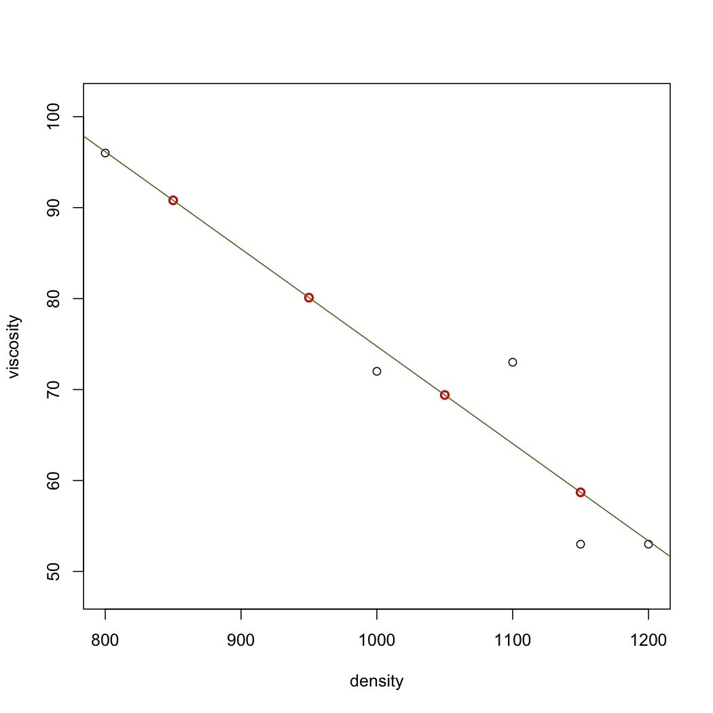

Recall that the prediction interval for :math:`\hat{y}` from a new x measurement :math:`x_\text{new}` is given by: :math:`\hat{y}_i \pm c_t \sqrt{V\{\hat{y}_i\}}` where :math:`\mathcal{V}\{\hat{y}_i\} = S_E^2\left(1 + \dfrac{1}{n} + \dfrac{(x_i - \bar{\mathrm{x}})^2}{\sum_j{\left( x_j - \bar{\mathrm{x}} \right)^2}}\right)`

Again, this is tedious to calculate by hand.  For example, to get the 90% prediction intervals:

.. code-block:: s

	y.hat.new.PI <- predict(model, newdata=density.new, interval="p", level=0.90)
	y.hat.new.PI
	#     fit      lwr       upr
	# 1 101.5 79.90412 123.09588
	# 2  90.8 71.94957 109.65043
	# 3  80.1 63.10846  97.09154
	# 4  69.4 53.07505  85.72495
	# 5  58.7 41.70846  75.69154
	# 6  48.0 29.14957  66.85043

The lower and upper bounds are the last two columns, while the fitted (prediction) values are in the first column. So now add the prediction interval to our visualization.  Notice the expected quadratic curvature.

.. code-block:: s

	plot(density, viscosity, ylim=range(y.hat.new.PI))
	points(density.new$density, y.hat.new.PI[,1], col="red", lwd=2)
	abline(model, col="darkgreen")
	lines(density.new$density, y.hat.new.PI[,2], col="red", lty=2)
	lines(density.new$density, y.hat.new.PI[,3], col="red", lty=2)

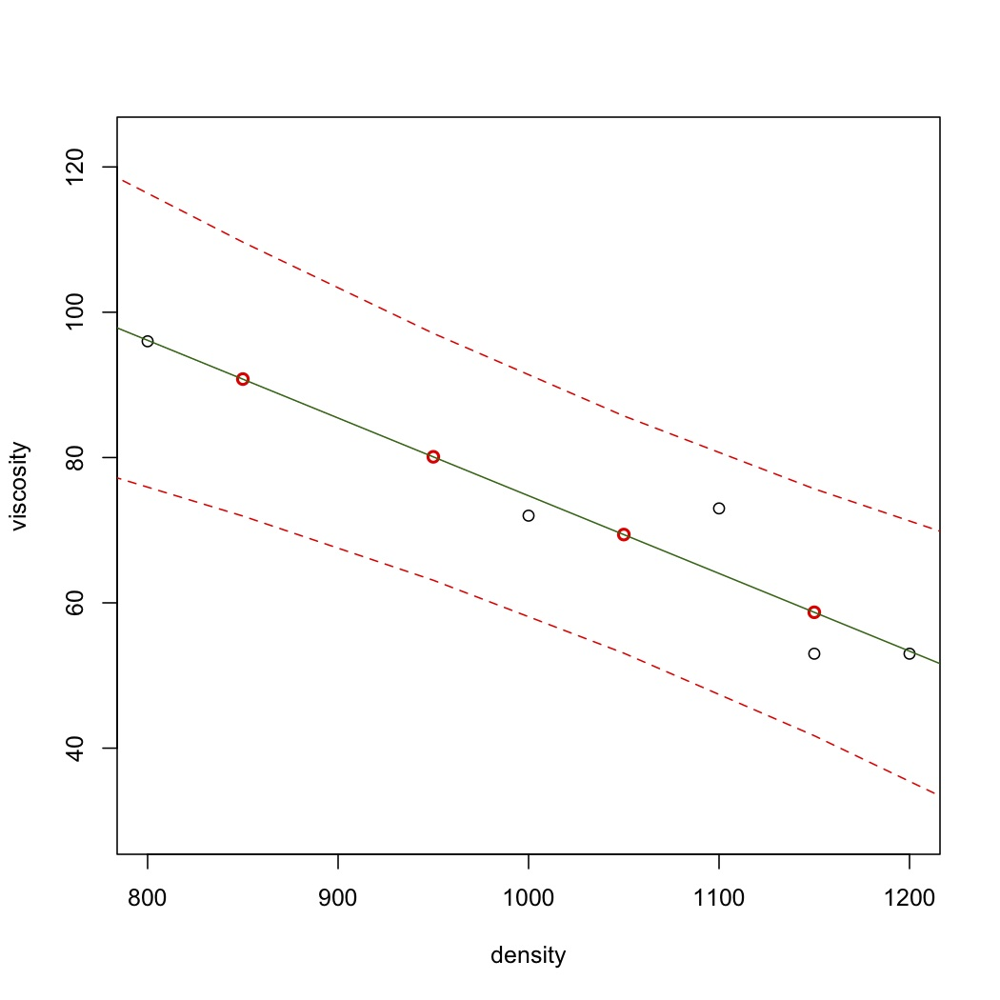

Testing a linear model in R
============================

In this section we show how to build a model from some data, and then test it on the rest.  Construct an x-vector ``input`` and a y-vector ``response`` both with 200 observations. Use 150 observation to build the model, then use the remaining 50 to test the model.

.. code-block:: s

	input <- rnorm(200, mean=50, sd=12)
	response <- 0.7*input + 50 + rnorm(200, sd=10)

	# Create index vectors that indicate observations for building and testing:
	build.index = seq(1, 150)
	test.index  = seq(151, 200)

	# Build the model:
	model <- lm(response ~ input, subset=build.index)
	summary(model)

	# Test model. Create data frame from the rest of the "input" x-variable.
	x.new <- data.frame(input = input[test.index])
	y.hat.new <- predict(model, newdata=x.new)

	# Get the actual y-values from the testing data
	y.actual = response[test.index]

	# Plot the errors first, looking for structure. 
	errors <- (y.actual - y.hat.new)
	plot(errors)

	# Calculate RMSEP, and compare to model's standard error, and residuals.
	RMSEP <- sqrt(mean(errors^2))
	summary(residuals(model))

.. remove observations from an existing model and rebuild it: lm(model, subset=build) to update the model 

Transformation of data in a linear model
========================================================

This is shown by example for a few different types of transformations:

.. list-table::
   :widths: 15 10 30
   :header-rows: 1

   * - Description
     - Desired model
     - Formula function in R
   * - Standard, univariate model
     - :math:`y = b_0 + b_1 x`
     - ``y ~ x``
   * - Force intercept to zero (check the degrees of freedom!)
     - :math:`y = b_1 x`
     - ``y ~ x + 0``
   * - Transformation of an :math:`x`  
     - :math:`y = b_0 + \sqrt{x}`
     - ``y ~ sqrt(x)``
   * - Transformation of :math:`y`
     - :math:`\log(y) = b_0 + b_1 x`
     - ``log(y) ~ x``
   * - Transformation of :math:`y`
     - :math:`100/y= b_0 + b_1 x`
     - ``100/y ~ x``
   * - Transformation of :math:`x`: **+, -, /, and ^ do not work on the right hand side!**
     - :math:`y= b_0 + b_1 \times 20/x`
     - ``y ~ 20/x`` *will give an error*
   * - Most transformations of :math:`x` must be wrapped in an AsIs ``I()`` operation:
     - :math:`y= b_0 + b_1 \times 20/x`
     - ``y ~ I(20/x)``  *will work*
   * - Another use of the AsIs ``I()`` operation
     - :math:`y= b_0 + b_1 x^2`
     - ``y ~ I(x^2)``
   * - Another use of the AsIs ``I()`` operation
     - :math:`y= b_0 + b_1 (x - \bar{x})`
     - ``y ~ I(x - mean(x))``

Investigating outliers, discrepancies and other influential points
================================================================================================================

Recall that **influence** is a measure of how each observation affects the model.  We use plots of these numbers to decide on how we should treat an outlier.

For this section we will use a data set that is built into R, the stack-loss data set. It is 21 days of plant data from oxidizing ammonia to nitric acid.

.. code-block:: s

	attach(stackloss)
	summary(stackloss)
	
	#     Air.Flow       Water.Temp      Acid.Conc.      stack.loss   
	#  Min.   :50.00   Min.   :17.00   Min.   :72.00   Min.   : 7.00  
	#  1st Qu.:56.00   1st Qu.:18.00   1st Qu.:82.00   1st Qu.:11.00  
	#  Median :58.00   Median :20.00   Median :87.00   Median :15.00  
	#  Mean   :60.43   Mean   :21.10   Mean   :86.29   Mean   :17.52  
	#  3rd Qu.:62.00   3rd Qu.:24.00   3rd Qu.:89.00   3rd Qu.:19.00  
	#  Max.   :80.00   Max.   :27.00   Max.   :93.00   Max.   :42.00

We will consider only the effect of air flow and stack loss (stack loss here in an inverse measure of plant efficiency).  Type ``help(stackloss)`` for more details about the data. Build the model and investigate the normality of the residuals. 

.. code-block:: s

	model <- lm(stack.loss ~ Air.Flow)
	library(car)
	
	qqPlot(resid(model), id.method = "identify")  
	
	# Now use the mouse to click on the outliers and ID them
	# Right-click to stop adding points

From clicking on the points we see that observations 1, 2, 3 and 21 are quite unusual. 

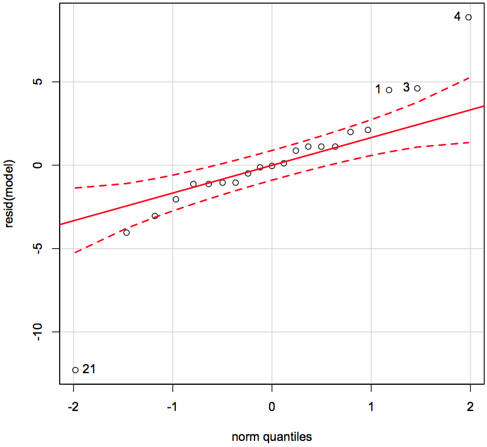

These observations have residuals larger than what would be expected from a normal distribution.  We don't exclude them yet.  Let's examine if they appear in some of the other plots.  

Leverage
~~~~~~~~~~~~~~~~~~~~~~~~~~~~~~~~~~~~~~~~~~

This is a plot of the hat-values::

.. code-block:: s
	
	plot(hatvalues(model))
	K <- length(coef(model))
	N <- nrow(stackloss)
	hat.avg <-  K/N 
	abline(h=c(2,3)*hat.avg, lty=2, col=c("orange", "red"))
	identify(hatvalues(model))

The average hat value is at :math:`\overline{h} = \frac{k}{n}`.  Observations 1 and 2 lie beyond only the 2 times the average hat value.  We are more concerned with points that have hat values beyond 3 times the average.

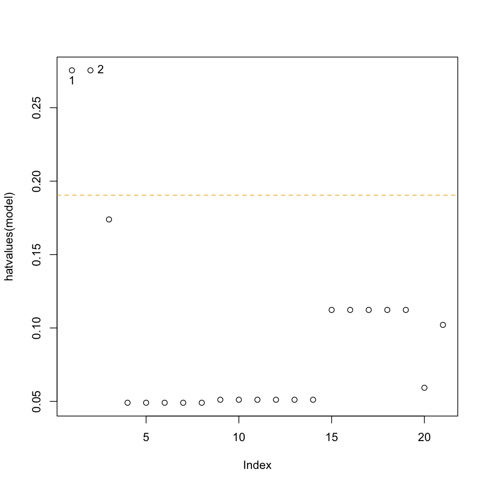

Discrepancy
~~~~~~~~~~~~~~~~~~~~~~~~~~~~~~~~~~~~~~~~~~

The discrepancy of each data point is found by plotting the studentized residuals:

.. code-block:: s

	plot(rstudent(model))
	abline(h=0, lty=2)
	abline(h=c(-2,2), lty=2, col="red")
	identify(rstudent(model))

Recall the cut-offs are at :math:`\pm 2` and contain 95% of the data (1 in 20 observations will naturally lie outside these limits).  Observations 4 and 21 lie outside the limits and should be investigated.  Was there anything extra going on with those observations?  Can another variable be included into the model that will reduce the size of the residuals for those points?

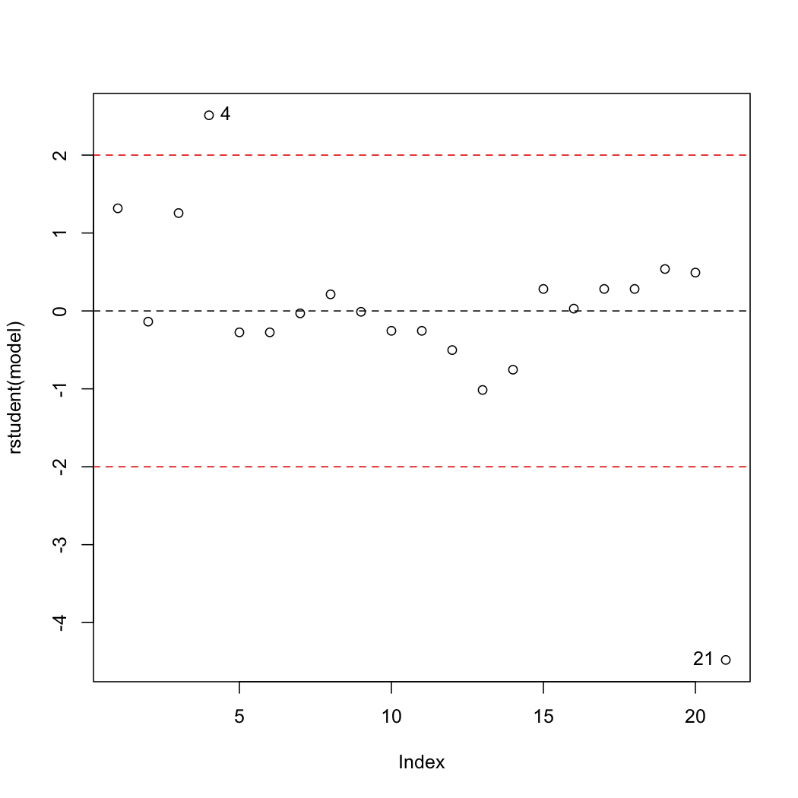

Influence
~~~~~~~~~~~~~~~~~~~~~~~~~~~~~~~~~~~~~~~~~~

A plot of the Cook's D values shows influence.  We loosely can describe influence as:

.. math::

	\text{Influence} = \text{Leverage} \times \text{Discrepancy}

though Cook's D calculates them slightly differently.

.. code-block:: s

	plot(cooks.distance(model))
	cutoff <- 4/model$df.residual
	abline(h=cutoff, lty=2, col=c("orange", "red"))
	identify(cooks.distance(model))

The cutoff for Cook's D is :math:`4/(n-k)`.  Observations 1 and 21 lie beyond only the cutoff in this data set.

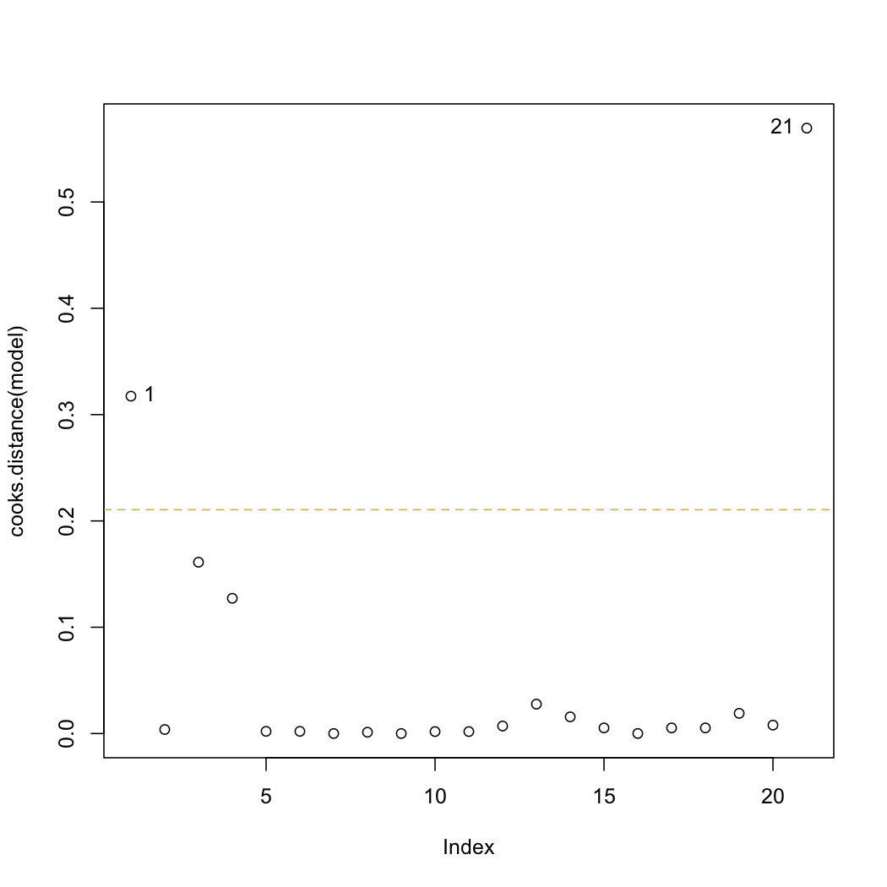

Combine leverage, discrepancy and influence to understand outliers
~~~~~~~~~~~~~~~~~~~~~~~~~~~~~~~~~~~~~~~~~~~~~~~~~~~~~~~~~~~~~~~~~~~~~~~~~

<syntaxhighlight lang="R">
library(car)
# Let the function auto-identify the outliers, and tell if which labels to use
influencePlot(model, identify="auto", labels=row.names(stackloss))
</syntaxhighlight>
The auto-identify function marks only observations with large Cook's distance values.  You should still investigate the other points.
| ''Click on image to enlarge'' 
[[Image:tutorial-5-influencePlot.png|250px]]
|}

Also see ``influence(model)`` and ``influence.measures(model)`` for other metrics used to assess influence on a model from each observation.

	=== Removing outliers and rebuilding the model ===

	After investigation of the above points, we decide to remove point 1 and 21 and rebuild the model:
	<syntaxhighlight lang="R">
	remove = -c(1, 21)
	model.rebuild <- lm(model, subset=remove)
	</syntaxhighlight>
	Note how easy it is rebuild the model: you give it the existing ``model`` and the observations to remove (note the "``-``" in front of the ``c()``).

	{| class="wikitable"
	|-
	| Then re-investigate the influence plot:
	<syntaxhighlight lang="R">
	influencePlot(model.rebuild, identify="auto", labels=row.names(stackloss)[remove])
	</syntaxhighlight>
	| ''Click on image to enlarge'' 
	[[Image:tutorial-5-influencePlot-rebuild.png|250px]]
	|}

	== Linear models with multiple X-variables (MLR) ==
	<!-- vcov(model) -->

	Including multiple variables in a linear model in R is straightforward.  Just extend the formula to the ``lm(...)`` function with extra terms.  For example:
	{| class="wikitable"
	|-
	!
	! Desired model
	! Formula function in R
	|-
	| Standard, univariate model
	| :math:`y = b_0 + b_1 x`
	| ``y ~ x``
	|-
	| Add an additional explanatory variable:
	| :math:`y = b_0 + b_1 x_1 + b_2 x_2`
	| ``y ~ x1 + x2``
	|}

	Using the stackloss example from earlier:
	<syntaxhighlight lang="R">
	attach(stackloss)
	colnames(stackloss)
	# [1] "Air.Flow"   "Water.Temp" "Acid.Conc." "stack.loss"
	model <- lm(stack.loss ~ Air.Flow +  Acid.Conc. + Water.Temp)
	summary(model)
	# Call:
	# lm(formula = stack.loss ~ Air.Flow + Acid.Conc. + Water.Temp)
	# 
	# Residuals:
	#     Min      1Q  Median      3Q     Max 
	# -7.2377 -1.7117 -0.4551  2.3614  5.6978 
	# 
	# Coefficients:
	#             Estimate Std. Error t value Pr(>|t|)    
	# (Intercept) -39.9197    11.8960  -3.356  0.00375 ** 
	# Air.Flow      0.7156     0.1349   5.307  5.8e-05 ***
	# Acid.Conc.   -0.1521     0.1563  -0.973  0.34405    
	# Water.Temp    1.2953     0.3680   3.520  0.00263 ** 
	# ---
	# Signif. codes:  0 ‘***’ 0.001 ‘**’ 0.01 ‘*’ 0.05 ‘.’ 0.1 ‘ ’ 1 
	# 
	# Residual standard error: 3.243 on 17 degrees of freedom
	# Multiple R-squared: 0.9136,	Adjusted R-squared: 0.8983 
	# F-statistic:  59.9 on 3 and 17 DF,  p-value: 3.016e-09
	</syntaxhighlight>

	We can interrogate this ``model`` object in the same way as we did for the single x-variable case.
	* ``residuals(model)``
	* ``fitted(model)``: predicted values of the model-building data
	* ``coef(model)``
	 # (Intercept)    Air.Flow  Acid.Conc.  Water.Temp 
	 # -39.9196744   0.7156402  -0.1521225   1.2952861
	* ``confint(model)``: provides the ''marginal'' confidence intervals (recall there are joint and marginal confidence intervals)
	* ``predict(model)``: can be used to get new predictions.  For example, create a new data frame with 2 observations:
	<syntaxhighlight lang="R">
	x.new = data.frame(Air.Flow = c(56, 62), Water.Temp = c(18, 24), Acid.Conc. = c(82, 89))
	x.new
	#   Air.Flow Water.Temp Acid.Conc.
	# 1       56         18         82
	# 2       62         24         89
	y.new = predict(model, newdata=x.new)
	y.new
	#        1        2 
	# 10.99728 21.99798
	</syntaxhighlight>

	== Linear models with integer variables ==

	The only additional step required to include an integer variable is to tell R that the variable a ``factor`` or categorical type variable.  R will then take care of expanding it into the extra columns required to fit the linear model.  The rest of the tools for linear models are then used as normal, e.g. ``confint(model)``, ``predict(model, ...)``  and so on.

	Let's start by creating a factor variable ourself.  Create a vector of "Pass" and "Fail" entries and convert it to a factor variable:
	<syntaxhighlight lang="R">
	pass.fail <- c("Pass", "Fail", "Fail", "Fail", "Fail", "Pass", "Pass")
	# What type of variable is this currently (i.e. what type of class of variable)?
	class(pass.fail)
	# [1] "character"    <--- so just of a bunch of character strings

	# Force it to be a factor type variable
	pass.fail <- as.factor(pass.fail)
	pass.fail
	# [1] Pass Fail Fail Fail Fail Pass Pass
	# Levels: Fail Pass

	class(pass.fail)
	# [1] "factor"
	</syntaxhighlight>

	Another example of creating a factor variable
	<syntaxhighlight lang="R">
	operator <- c(10, 12, 11, 10, 11, 10, 12, 11, 10)
	op.names <- factor(operator, levels=c("10", "11", "12"), labels=c("Pat", "Sarah", "Stef"))
	# [1] Pat   Stef  Sarah Pat   Sarah Pat   Stef  Sarah Pat  
	# Levels: Pat Sarah Stef
	is.factor(op.names)
	[1] TRUE
	</syntaxhighlight>

	You may not even need to create a factor variable in many cases.  When you import a data set R will detect and create factors automatically - usually it gets it right - like the "Yes"/"No" baffles variable used in [[Assignment_5_-_2010]]:
	<syntaxhighlight lang="R">
	bio <- read.csv('http://stats4.eng.mcmaster.ca/datasets/bioreactor-yields.csv')
	bio
	#    temperature duration speed baffles   yield
	# 1           82      260  4300      No      51
	# 2           90      260  3700     Yes      30
	# 3           88      260  4200     Yes      40
	# 4           86      260  3300     Yes      28
	# 5           80      260  4300      No      49
	# 6           78      260  4300     Yes      49
	# 7           82      260  3900     Yes      44
	# 8           83      260  4300      No      59
	# 9           64      260  4300      No      60
	# 10          73      260  4400      No      59
	# 11          60      260  4400      No      57
	# 12          60      260  4400      No      62
	# 13         101      260  4400      No      42
	# 14          92      260  4900     Yes      38
	</syntaxhighlight>

	Fitting a linear model with this integer variable:
	<syntaxhighlight lang="R">
	attach(bio)
	model <- lm(yield ~ temperature + speed + baffles)
	coef(model)
	#  (Intercept)  temperature        speed   bafflesYes 
	# 52.483652163 -0.470996834  0.008710973 -9.090699955
	</syntaxhighlight>

	So the -9.09 is the model coefficient for when the ``baffles`` variable is at the ``"Yes"`` level.  You can view the underlying :math:`\mathbf{X}` matrix for this linear model quite easily:
	<syntaxhighlight lang="R">
	model.matrix(model)
	#    (Intercept) temperature speed bafflesYes
	# 1            1          82  4300          0
	# 2            1          90  3700          1
	# 3            1          88  4200          1
	# 4            1          86  3300          1
	# 5            1          80  4300          0
	# 6            1          78  4300          1
	# 7            1          82  3900          1
	# 8            1          83  4300          0
	# 9            1          64  4300          0
	# 10           1          73  4400          0
	# 11           1          60  4400          0
	# 12           1          60  4400          0
	# 13           1         101  4400          0
	# 14           1          92  4900          1
	# attr(,"assign")
	# [1] 0 1 2 3
	# attr(,"contrasts")
	# attr(,"contrasts")$baffles
	# [1] "contr.treatment"
	</syntaxhighlight>

	These would be the column in the :math:`\mathbf{X}` matrix, confirming that the coefficient for ``baffles`` is the effect of going from ``No`` to ``Yes``.  

	I point this out, because R will by default create the factors in alphabetical order (0 = "No", "1"="Yes").  But in other cases this default leads to the opposite of what you might want, for example 0="Accept", 1="Reject".  You can always reorder an existing factor:
	<syntaxhighlight lang="R">
	disp <- c("Accept", "Accept", "Reject", "Accept", "Accept", "Reject")
	disp <- factor(disp, levels=c("Reject", "Accept"))  # switch the default order around
	</syntaxhighlight>

	=== Predictions when integer variables are in the model ===

	As before, we use the ``predict()`` function, once we have a data frame containing the new data.  Create two observations where the only difference is the baffle indicator:
	<syntaxhighlight lang="R">
	x.new = data.frame(temperature=82, speed=4200, baffles=c("Yes", "No"))
	x.new
	#   temperature speed baffles
	# 1          82  4200     Yes
	# 2          82  4200      No
	y.new = predict(model, newdata=x.new, interval="p")
	y.new
	      fit      lwr      upr
	1 41.3573 30.03813 52.67647
	2 50.4480 39.23712 61.65888
	</syntaxhighlight>
	The above output shows the effect of a baffle, together with the prediction intervals.  Does this output match the interpretation of the model coefficient for the ``baffle`` variable?

Next steps (coming soon)
=========================

* Describe R data frames.
* Analysis of designed experiments using R 
* Principal component analysis using R

